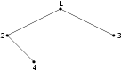

## 문제

As we all know ants are able to raise aphides. Aphides produce sweet honey dew, which is drank by ants. Ants defend aphides against the bitterest enemies of theirs - ladybugs. On the tree near to the anthill there lives such culture of aphides. Aphides feed on leaves and ramifications of the tree. There are  ant-guards (numbered from 1 to n). A ladybug threatens the culture, she always sits in places where aphides appear, (i.e. on leaves or ramifications). When a ladybug sits on the tree guard-ants set off in her direction in order to chase her away. They comply with the following rules:

* between any two chosen places on the tree (leaves or ramifications) there is exactly one way to go without turning back - each of the ants starts going along such route to the place of ladybug's landing,
* if there is an ant in the place of the ladybug's landing, the ladybug takes off immediately,
* if there is another ant on the route to the ladybug landing place, then the ant that is farther from the ladybug stops its wandering and remains on its current position,
* if two or more ants try to get to the same ramification of the tree, only one reaches it - the one with the least number, the others stay on their positions (leaves or ramifications),
* an ant which gets to the place of ladybug's landing chases it away and stays on this position.

The ladybug is stubborn and lands on the tree again. Then ants set off again trying to chase away the intruder. In order to simplify we assume that getting through one branch connecting a leaf with a ramification or connecting two ramifications takes a unit of time.

Write a program which:

* reads from the standard input the description of the tree, the start positions of ants, and places where the ladybug lands,
* for each ant finds its final position and number of times this ant chased the ladybug away,
* writes the result to the standard output.

## 입력

In the first line of the standard input there is one integer n, equal to the number of leaves and ramifications on the tree, 1 ≤ n ≤ 5,000. We assume that leaves and ramifications are numbered from 1 to n. Each of the following n-1 lines describes a branch --- a description consist of two integers a and b, it means that a given branch connects places a and b of the tree. The branches allow to get from one place to the another. In the (n+1)-st line there is one integer k, 1 ≤ k ≤ 1,000 and k ≤ n; k is equal to number of ants that guard the tree. In each of the following k lines one positive integer (not greater than n) is written. An integer written in (n+1+i)-th line is a start position of the i-th ant. There is no position on the tree (neither leaf nor ramification) with more than one ant. In the line n+k+2 there is one integer l, 1 ≤ l ≤ 500, l says how many times a ladybug lands on the tree. In each of the following l lines one positive integer (not greater than n) is written. These numbers describe the places in which the ladybug successively lands.

## 출력

Your program should write k lines to the standard output. In the i-th line there should be written two integers separated by a single space - the final position of the i-th ant (number of a ramification or a leaf) and the number indicating how many times the i-th ant chased the ladybug away.

## 힌트

For the input data:

