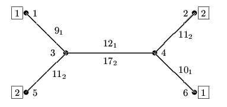

## 문제

Let us consider a diagram describing a net of municipal transportation, for example a bus-net, tram-net or underground-net etc. Vertices of the diagram (numbered 1,2,…,n), correspond to stations, edges (pi,pj), (where pi≠pj) denote that there is a direct connections from the station pi to the station pj (1 ≤ pi,pj ≤ n). Transportation lines are numbered 1,2,…,k. The transportation line no. l is defined as a series of stations pl,1,pl,2,…,pl,sl, on which vehicles of the line no. l stop, and durations rl,1,rl,2,…,rl,sl-1 of traveling between stations - rl,1is the time necessary to get from the station pl,1 to the station pl,2, or vice versa (i.e. from the station pl,2 to the station pl,1); rl,2 is the time necessary to get from the station pl,2 to pl,3, etc. All the stations of a line are different (i.e. i≠j implies pl,i≠pl,j). In the transportation line no. l vehicles run with certain frequency cl, where cl is a number from the set {6,10,12,15,20,30,60}. The vehicles in the transportation line no. l start from the station pl,1 at each hour of the day and night, g:0, (0 ≤ g ≤ 23), and than according to the frequency of the line i.e. at g:cl, g:2cl,… etc. (g:cl means cl minutes after hour g). Vehicles of the line l run in two directions: from the station pl,1 to pl,sl, and from the station pl,sl to pl,1. The hours of departure of the vehicles of the transportation line no. l from the station pl,sl are the same as from the station pl,1.

In such a transportation net we want to make a trip from the start station x to the finish station y. We assume that the trip is possible and will take no longer than 24 hours. During the trip one can change transportation lines as many times as he/she wants to. Say, the time of a change is equal to 0, however, while changing the line we have to take under consideration the time of waiting for the vehicle that we want to get into. Our purpose is to get from the start station x, to the finish station y, as quick as it is possible.

For example :

On the picture below you can see a scheme of the transportation net with 6 stations and two lines: no. 1 and no. 2. Vehicles of the line no. 1 go between stations 1, 3, 4 and 6, vehicles of the line no. 2 go between stations 2, 4, 3 and 5. The frequencies with which the vehicles run are equal to c1=15 and c2=20 respectively. The durations of travel between stations are written next to the edges of the net; they are given indices 1 and 2 for particular lines.

Let us assume, that at 23:30 we stay on the station no. 5 and we want to get to the station no. 6. It is necessary to wait 10 minutes and then (at 23:40) one can leave using line no. 2. There are two options of our trip. The first option is to get to the station no. 3 at 23:51, wait 3 minutes, change to the line no. 1 at 23:54 and get to the station 6 at 0:16 (the next day). The second option is to take the line no. 2 and get to the station no. 4 at 0:8 a.m., we wait 13 minutes and at 0:21 a.m. we take the vehicle of the line no. 1 and we get to the station no. 6 at 0:31. Thus the earliest time we can get to the station no. 6 is at 0:16.

Write a program which:

* reads from the standard input the description of the transportation net, transportation lines, number of the start station x, number of the finish station y, the hour and minute of the beginning of the trip - gx and mx respectively,
* finds the shortest time of the trip from the start station x to the finish station y,
* writes to the standard output the earliest possible time of getting to the finish station y - gy and my (hour and minute respectively).

## 입력

In the first line of the standard input there are written six integers, separated by single spaces:

* the number of stations n (1 ≤ n ≤ 1,000),
* the number of lines k (1 ≤ k ≤ 2,000),
* the number of the start station x (1 ≤ x ≤ n),
* the number of the finish station y (1 ≤ y ≤ n),
* the hour of the beginning of the trip gx (0 ≤ gx ≤ 23),
* the minute of the beginning of the trip mx (0 ≤ mx ≤ 59).

The stations are numbered from 1 to n, the transportation lines from 1 to k. In the following 3k lines the transportation lines are described - the description of each of them takes three consecutive lines.

* In the first line describing the transportation line no. l there are written two integers, separated by a single space: sl, the number of stations (2 ≤ sl ≤ n), and cl - the frequency with which the vehicles run (cl ∈ {6,10,12,15,20,30,60}).
* In the second line describing the transportation line no. l there are sl different integers, separated by single spaces: pl,1,pl,2,…,pl,sl - the numbers of consecutive stations on the transportation line no. l (1 ≤ pl,i ≤ n, for 1 ≤ i ≤ sl).
* In the third line describing the transportation line no. l there are written sl-1 integers separated by single spaces: rl,1,rl,2,…,rl,sl-1 - the times (in minutes) necessary to go between the consecutive stations of this transportation line (1 ≤ rl,i ≤ 240, for 1 ≤ i ≤ sl-1).

The total number of stations on all transportation lines is not greater than 4000 (i.e. s1+s2+…+sk ≤ 4,000).

## 출력

Your program should write in the only line of the standard output two integers, separated by a single space: the hour of the earliest possible arrival to the finish station gy (0 ≤ gy ≤ 23) and the minute of the earliest possible arrival to the finish station my (0 ≤ my ≤ 59).
