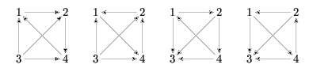

## 문제

A tournament is a directed graph in which:

* for each two different vertices  and  there exsits exactly one edge between them (i.e. either u→v or v→u),
* there are no loops (i.e. for each vertex u there is no edge u→u).

Let p denote any permutation of the set of tournament's vertices. (A permutation of a finite set is an injective function from X to X.) The permutation p is called an automorphism, if for each two different vertices u and v the direction of the edge between u and v is the same as the direction of the edge between p(u) and p(v) (i.e. u→v is an edge in the tournament if and only if p(u)→p(v) is an edge in this tournament). For a given permutation p, we want to know for how many tournaments this permutation is an automorphism.

Let's take the set of vertices 1,…,4 and the permutation p: p(1)=2, p(2)=4, p(3)=3, p(4)=1. There are only four tournaments for which this permutation is an automorphism:

Write a program which:

* reads the description of a permutation of an n-element set from the standard input,
* computes t, the number of different n-element tournaments for which this permutation is an automorphism,
* writes to the standard output the remainder of dividing t by 1,000

## 입력

In the first line of the standard input there is one integer n, 1 ≤ n ≤ 10,000, which is the number of vertices. In the following n lines there is a description of a permutation p. We assume that vertices are numbered from 1 to n. In line (k+1) there is a value of the permutation p for the vertex k (i.e. the value p(k)).

## 출력

In the first and only line of the standard output there should be one integer equal to the remainder of dividing t (the number of different n-vertex tournaments for which p is an automorphism) by 1,000.
