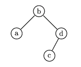

## 문제

A binary tree can either be empty or consist of one vertex, with two trees linked to it. These two trees are called a left and a right subtree. In each vertex there is one letter from the English alphabet. The vertex which is not a subtree of any vertex, is called a root. We say that a tree is a Binary Search Tree (BST) if for each vertex the following condition is satisfied: all letters in the left subtree precede in alphabetical order the letter in the root, and all letters from the right subtree follow the letter in the root. A code of a BST is:

    either an empty string (containing 0 letters) when the tree is empty  
    or a string beginning with the letter from the root, followed by the code of the left subtree, followed by the code of the right subtree.

Let us consider all -vertex BSTs containing in their vertices k initial letters of the English alphabet. Suppose we have a list of these codes written in alphabetical order. (n,k)-code is the n-th code on this list.

For example :

There are exactly fourteen 4-vertex BSTs. These are (in alphabetical order):

    abcd abdc acbd adbc adcb bacd badc cabd cbad dabc dacb dbac dcab dcba

The string badc is the (7,4)-code and it corresponds to the BST printed below:  

Write a program which:

* reads the numbers  and  from the standard input,
* finds the (n,k)-code,
* writes it to the standard output.

## 입력

In the first and only line of the standard input there are exactly two positive integers n and k, separated by a single space, 1 ≤ k ≤ 19. The number n is not greater than the number of codes of BST with k vertices.

## 출력

In the first and only line of the standard output there should be exactly one word (written in small letters) being the (n,k)-code.
