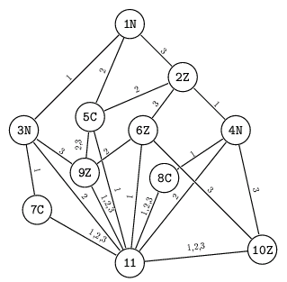

## 문제

There is a mythical labyrinth of wells inside the Bytemountain. The entrance to the labyrinth is placed on the top of the mountain. The labyrinth is a combination of many rooms. Each of them is in one of the following colors: red, green, blue. Two rooms of the same color look identically and are undistinguishable. In each room there are three wells numbered with integers 1, 2 and 3. There is only one way to get from one room to another - jumping into the well in the upper room one falls (not necessarily vertically) to the room at the bottom of the well. From the entrance room it is possible to reach any other room. All the passages through the labyrinth lead to the dragon's lair, which is situated at the very bottom. Each journey through the labyrinth corresponds to a series of numbers of wells chosen in sequently visited rooms. This series is called a journey plan.

The Bytedragon lives in the dragon's lair. Legends say that the one, who presents the whole plan of the labyrinth to the dragon, will get a huge treasure. All the others are kicked out of the mountain with a great strike by Bytedragon's foot.

A hero called BYTEZAR has moved many times through the labyrinth and has made his plan. Evenso Bytedragon said that however all the rooms are on the map, many of them appear there more than once.

I made a similar picture - said Bytedragon patting Bytezar's shoulder - but have found soon that although I have built fewer rooms, the visitor passing the labyrinth according to any journey plan will still see the same sequences of colors of rooms. I thought a little and decided to reduce the plan maximally.

Write a program which:

* reads Bytezar's map from the standard input,
* counts the true number of rooms in the labyrinth,
* writes it into the standard output.

## 입력

In the first line of the standard input there is one integer n, 2 ≤ n ≤ 6,000, which is the number of rooms (including the dragon's lair). The rooms are numbered from 1 to n so, that rooms with bigger numbers are situated lower (the entrance room has number 1, and the dragon's lair has number n). The following n-1 lines of the file describe the rooms of the labyrinth (except the dragon's lair) and wells leading down. There is a letter, one space, and three integers separated by single spaces in each of these lines. The letter stands for the color of the room (C - red, Z - green, N - blue), and the i-th number (for i=1,2,3) is the number of the room into which the i-th well leads.

## 출력

In the first and only line of the standard output there should be exactly one integer. This is the minimal number of rooms in the labyrinth (including the dragon's lair) that is equivalent to the labyrinth described in the input file. The equivalence means that a traveller passing each of these labyrinths according to any journey plan will observe the same sequences of colors of rooms.

## 힌트

