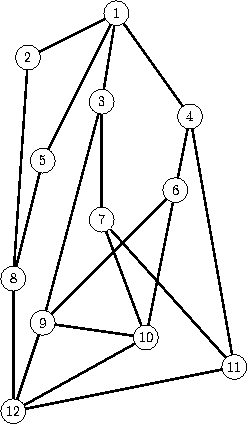

## 문제

A team of speleologists organizes a training in the Great Cave of Byte Mountains. During the training each speleologist explores a route from Top Chamber to Bottom Chamber. The speleologists may move down only, i.e. the level of every consecutive chamber on a route should be lower then the previous one. Moreover, each speleologist has to start from Top Chamber through a different corridor and each of them must enter Bottom Chamber using different corridor. The remaining corridors may be traversed by more then one speleologist. How many speleologists can train simultaneously?

Write a program which:

* reads the cave description from the standard input,
* computes the maximal number of speleologists that may train simultaneously,
* writes the result to the standard output.

## 입력

In the first line of the standard input there is one integer n (2 ≤ n ≤ 200), equal to the number of chambers in the cave. The chambers are numbered with integers from 1 to n in descending level order - the chamber of greater number is at the higher level than the chamber of the lower one. (Top Chamber has number 1, and Bottom Chamber has number n). In the following n-1 lines (i.e. lines 2,3,…,n) the descriptions of corridors are given. The (i+1)-th line contains numbers of chambers connected by corridors with the -th chamber. (only chambers with numbers grater then i are mentioned). The first number in a line, m, 0 ≤ m ≤ (n-i+1), is a number of corridors exiting the chamber being described. Then the following  integers are the numbers of the chambers the corridors are leading to.

## 출력

Your program should write one integer in the only line of the standard output. This number should be equal to the maximal number of speleologists able to train simultaneously.

## 힌트

