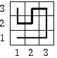
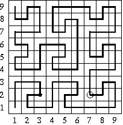

## 문제

here is a building with flat square roof of size 3k x 3k and sides parallel to north-south and east-west directions. The roof is covered with square tiles of size 1 (with a side of length 1), but one of the tiles has been removed and there is a hole in the roof (big enough to fall in). The tiles form a rectangular mesh on the roof, so their positions may be specified with coordinates. The tile at the southwestern corner has coordinates (1,1). The first coordinate increases while going eastwards, and the second while going northwards.

Sleepwalker wanders across the roof, in each step moving from the tile he is standing on to the adjacent one on the east (E), west (W), south (S), or north(N). The sleepwalker roof ramble starts from the southwestern corner tile. The description of the path is a word dk built of the letters N, S, E, W denoting respectively a step to the north, south, east and west. For k=1 the word describing the path of sleepwalker is

d1 = EENNWSWN.

For k=2 the word describing the path of sleepwalker is

d2 =  NNEESWSEENNEESWSEEEENNWSWNNEENNWSW -  
NNEENNWSWNWWWSSENESSSSWWNENWWSSW -  
WNENWNEENNWSWN.

(See the picture that shows how the sleepwalker would go across a roof of dimension 3 x 3 or 9 x 9) Generally, if k ≥ 1, the description of a sleepwalker's path on the roof of dimension 3k+1 x 3k+1 is a word:

    dk+1 = a(dk) E a(dk) E dk N dk N dk W c(dk) S b(dk) W b(dk) N dk

where functions a, b and c denote the following permutations of letters specifying directions:

* a: E->N W->S N->E S->W
* b: E->S W->N N->W S->E
* c: E->W W->E N->S S->N

E.g. a(SEN)=WNE, b(SEN)=ESW, c(SEN)=NWS.

We start observing sleepwalker at the time he stands on the tile of coordinates (u1,u2). After how many steps will sleepwalker fall into the hole made after removing the tile of coordinates (v1,v2)?

Example :   
There are sleepwalker's paths on roofs of dimension 3 x 3 and 9 x 9 on the picture below. In the second case, the point at which the observation starts and the hole have been marked. The sleepwalker has exactly 20 steps to the hole (from the moment the observation starts).  

Write a program which:

* reads from the standard input integer k denoting the size of the roof (3k x 3k), the position of the sleepwalker at the moment the observation starts and the position of the hole,
* computes the number of steps that the sleepwalker will make before he falls into the hole,
* writes the result to the standard output.

## 입력

In the first line of the standard input one integer k, 1 ≤ k ≤ 60, denoting the size of the roof (3k x 3k) is written. In each of the following two lines of the input two natural numbers x, y separated with a space are written, 1 ≤ x ≤ 3k, 1 ≤ y ≤ 3k. The numbers in the second line are the coordinates of the tile the sleepwalker is standing on. The numbers in the third line are the coordinates of the hole. You may assume, that with these data the sleepwalker will eventually fall into the hole after some number of steps.

## 출력

The only line of standard output should contain the number of steps on the sleepwalker's path to the hole.
