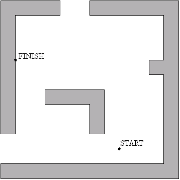
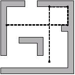
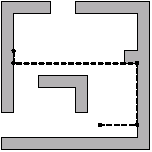
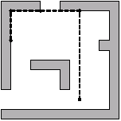

## 문제

A skating competition was organized on the largest icerink in Byteland. The icerink is a square of size 10,000 x 10,000. A competitor begins skating at the START point chosen by referees and his task is to finish sliding at the FINISH point, also chosen by referees. The points of START and FINISH are different. One can slide in directions parallel to the sides of the icerink. There are some obstacles placed on the icerink. Each obstacle is a prism, which base is a polygon with sides parallel to the sides of the icerink. Each two adjacent sides of the base are always perpendicular. The obstacles do not have common points. Each slide finishes up at the point where a competitor, for the first time, meets the wall of an obstacle, which is perpendicular to the direction of the slide. In other words, one can stop only when he crashes on a wall or in the FINISH point. Falling out of the icerink causes disqualification. Competitor may slide along walls of an obstacle.

Decide, whether a competitor who slides according to the given rules may reach the finish point, assuming he begun sliding from the starting point. If so, what is the minimal number of slides he needs to do?

Write a program which:

* reads the description of the icerink, obstacles, and the coordinates of the start and finish point from the standard input,
* verifies, whether a competitor who begins from the starting point and slides according the rules may reach the finish point, and if so, computes the minimal number of slides he needs to do,
* writes the result to the standard output.

## 입력

We define a system of coordinates to describe positions of objects on a rink. The rink is a square with vertices (0, 0), (10,000, 0), (10,000, 10,000), (0, 10,000). In the first line of standard input there are two integers z1 and z2 separated by a single space, 0 ≤ z1,z2 ≤ 10,000. The pair (z1,z2) denotes coordinates of the START point. In the second line of the file there are two integers t1 and t2 separated by single space, 0 ≤ t1,t2 ≤ 10,000. The pair (t1,t2) denotes coordinates of the FINISH point. The third line of the file contains one integer s, 1 ≤ s ≤ 2500. This is the number of obstacles. The following lines comprise descriptions of s obstacles. Each description of an obstacle begins with the line containing one positive integer r equal to the number of walls (sides of the base) of the obstacle. In each of the following r lines there are two integers x and y separated by a single space. These are the coordinates of the vertices of the obstacle's base, given in a clockwise order. (i.e. when going around the obstacle in this direction the inside is on the left-hand side). The total number of side walls of the obstacles does not exceed 10,000.

## 출력

Your program should write in the only line of the standard output:

* either one word NIE (means "no" in Polish) if it's impossible to get from the START point to the FINISH point
* or the minimal number of slides necessary to get to the FINISH point, if it is possible.

## 힌트

Sample input; describing the following configuration of obstacles:

Sample output; These are possible sequences of slides of length 4:  

