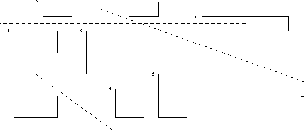

## 문제

According to Chinese folk believes evil spirits can move only on a straight line. It is of a great importance when temples are built. The temples are constructed on rectangular planes with sides parallel to the north - south or east - west directions. No two of the rectangles have common points. An entrance is situated in the middle of one of four walls and its width is equal to the half of the length of the wall. An altar appears in the center of the temple, where diagonals of the rectangle intersect. If an evil spirit appears in this point, a temple will be profaned. It may happen only if there exists a ray which runs from an altar, through an entrance to infinity and neither intersects nor touches walls of any temple (on a plane parallel to the plane of a construction area), i.e. one can draw at a construction area a line which starts at the altar and runs to the infinity without touching any wall.

Write a program which:

* reads descriptions of the temples from the standard input,
* verifies which temples could be profaned,
* writes their numbers to the standard output.

## 입력

In the first line of the standard input one integer n, the number of temples, 1 ≤ n ≤ 1000, is written.

In each of the following n lines there is a description of one temple (in i-th line a description of the i-th temple). The description of a temple consists of four non-negative integers, not greater than 8000 and a letter E, W, S or N. Two first numbers are coordinates of a temple's northern-west corner and two following are coordinates of an opposite southern-east corner. In order to specify coordinates of a point first we give its geographical longitude, which increases from the west to the east, and then its latitude, which increases from the south to the north. The fifth element of the description indicates the wall with the entrance (E - eastern, W - western, S - southern, N - northern). The elements of the temple's description are separated by single spaces.

## 출력

In the following lines of the standard output your program should write in ascending order numbers of the temples, which may be profaned by an evil spirit. Each number is placed in a separate line. If there are no such numbers, you should write one word: BRAK (means "lack" in Polish).

## 힌트

The picture shows the temples described in sample input. The dashed lines show possible routes of evil spirits.  

