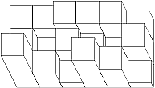
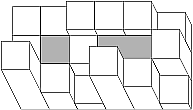

## 문제

On a rectangular mesh comprising n x m fields, n⋅m cuboids were put, one cuboid on each field. A base of each cuboid covers one field and its surface equals to one square inch. Cuboids on adjacent fields adhere one to another so close that there are no gaps between them. A heavy rain pelted on a construction so that in some areas puddles of water appeared.

Write a program which:

* reads from the standard input a size of the chessboard and heights of cuboids put on the fields,
* computes maximal water volume, which may gather in puddles after the rain,
* writes results to standard output.

## 입력

In the first line of the standard input two positive integers n and m, 1 ≤ n ≤ 100, 1 ≤ m ≤ 100 are written. They are the size of the mesh. In each of the following n lines there are m integers from the interval [1, 10,000]; i-th number in j-th line denotes a height of a cuboid given in inches put on the field in the i-th column and j-th raw of the chessboard.

## 출력

Your program should write in the first and the only line of the standard output one integer equal to the maximal volume of water (given in cubic inches), which may gather in puddles on the construction.

## 힌트

A picture below shows the mesh after the rain (seen from above). Puddles are drawn in gray.

