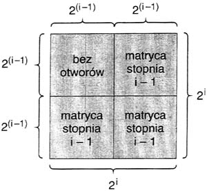
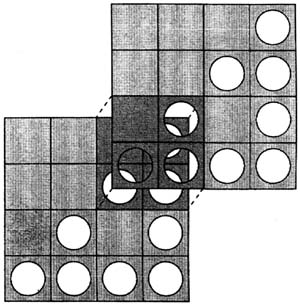

## 문제

The Painter's Studio is preparing mass production of paintings. Paintings are going to be made with aid of square matrices of various sizes. A matrix of size i consists of 2i rows and 2i columns. There are holes on intersections of some rows and columns. Matrix of size 0 has one hole.

For i > 0, matrix of size i is built of four squares of size 2i-1 × 2i-1. Look at the following figure (“bez otworow” means “with no holes” in Polish, “matryca stopnia” means “matrix of size”):

Both squares on the right side and the bottom-left square are matrices of size i-1. Top-left square has no holes. Pictures are constructed in the following way. First, we fix three non-negative integers n, x, y. Next, we take two matrices of size n, place one of them onto the other and shift the upper one x columns right and y rows up. We place such a pattern on a white canvas and cover the common part of matrices with the yellow paint. In this way we get yellow stains on the canvas in the places where the holes in both matrices agree.

Consider two matrices of size 2.

The upper matrix was shifted 2 columns right and 2 rows up. There are three places where holes agree.

Write a program that:

* reads the sizes of two matrices and the numbers of columns and rows that the upper matrix should be shifted by, from the standard input;
* computes the number of yellow stains on the canvas;
* writes the result to the standard output.

## 입력

There is one integer n, 0 ≤ n ≤ 100 in the first line of the standard input. This number is the size of matrices used for production of paintings. In the second line there is one integer x and in the third line one integer y, where 0 ≤ x, y ≤ 2n. The integer x is the number of columns and y is the number of rows that the upper matrix should be shifted by.

## 출력

In the first line of the standard output there should be written the number of stains on the canvas.
