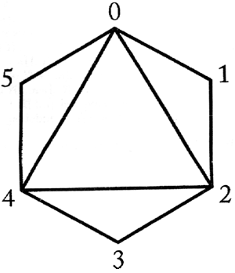

## 문제

We say that two triangles intersect if their interiors have at least one common point. A polygon is called convex if every segment connecting any two of its points is contained in this polygon. A triangle whose vertices are also vertices of a convex polygon is called an elementary triangle of this polygon. A triangulation of a convex polygon is a set of elementary triangles of this polygon, such that no two triangles from the set intersect and a union of all triangles covers the polygon.

We are given a polygon and its triangulation. What is the maximal number of triangles in this triangulation that can be intersected by an elementary triangle of this polygon?

Consider the following triangulation:

The elementary triangle (1, 3, 5) intersects all the triangles in this triangulation.

Write a program that:

* reads the number of vertices of a polygon and its triangulation from the standard input;
* computes the maximal number of triangles intersected by an elementary triangle of the given polygon;
* writes the result to the standard output.

## 입력

In the first line of the standard input there is a number n, 3 ≤ n ≤ 1,000, which equals the number of vertices of the polygon. The vertices of the polygon are numbered from 0 to n-1 clockwise.

The following n-2 lines describe the triangles in the triangulation. There are three integers separated by single spaces in the (i+1)-st line, where 1 ≤ i ≤ n-2. These are the numbers of the vertices of the i-th triangle in the triangulation.

## 출력

In the first and only line of the standard output there should be exactly one integer — the maximal number of triangles in the triangulation, that can be intersected by a single elementary triangle of the input polygon.
