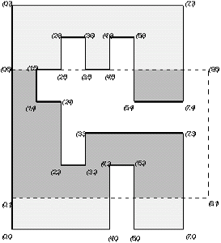

## 문제

We have a polygon chosen in the cartesian coordinate system. Sides of the polygon are parallel to the axes of coordinates. Every two consecutive sides are perpendicular and coordinates of every vertex are integers. We have also given a window that is a rectangle whose sides are parallel to the axes of coordinates. The interior of the polygon (but not its periphery) is coloured red. What is the number of separate red fragments of the polygon that can be seen through the window?

Look at the figure below:

There are two separate fragments of the polygon that can be seen through the window.

Write a program that:

* reads descriptions of a window and a polygon from the standard input;
* computes the number of separate red fragments of the polygon that can be seen through the window;
* writes the result to the standard output.

## 입력

In the first line of the standard input there are four integers x1, y1, x2, y2 from the range [0..10,000], separated by single spaces. The numbers x1, y1 are the coordinates of the top-left corner of the window. The numbers x2, y2 are the coordinates of the bottom-right corner of the window.

The next line of the input file contains one integer n, 4 ≤ n ≤ 5,000, which equals the number of vertices of the polygon. In the following n lines there are coordinates of polygon's vertices given in anticlockwise direction, i.e. the interior of the polygon is on the left side of its periphery when we move along the sides of the polygon according to the given order. Each line contains two integers x, y separated by a single space, 0 ≤ x ≤ 10,000, 0 ≤ y ≤ 10,000. The numbers in the (i+2)-nd line, 1 ≤ i ≤ n, are coordinates of the i-th vertex of the polygon.

## 출력

In the first and only line of the standard input there should be one integer — the number of separate red fragments of the polygon that can be seen through the window.
