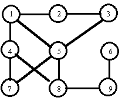

## 문제

Chase is a two-person board game, we call the players A and B. A board consists of squares numbered from 1 to n. For each pair of different squares it is known if they are adjacent to one another or they are not. Each player has a piece at his disposal. At the beginning of a game pieces of players are placed on fixed, distinct squares. In one turn a player can leave his piece on the square it stands or move it to an adjacent square.

A game board has the following properties:

* it contains no triangles, i.e. there are no three distinct squares such that each pair of them is adjacent,
* each square can be reached by each player.

A game consists of many turns. In one turn each player makes a single move. Each turn is started by player A.

We say that player A is caught by player B if both pieces stand on the same square. Decide, if for a given initial positions of pieces, player B can catch player A, independently of the moves of his opponent. If so, how many turns player B needs to catch player A if both play optimally (i.e. player A tries to run away as long as he can and player B tries to catch him as quickly as possible).

Consider the board in the figure. Adjacent squares (denoted by circles) are connected by edges. If at the beginning of a game pieces of players A and B stand on the squares 9 and 4 respectively, then player B can catch player A in the third turn (if both players move optimally). If game starts with pieces on the squares 8 (player A) and 4 (player B) then player B cannot catch player A (if A plays correctly).

Write a program that:

* reads from the standard input the description of a board and numbers of squares on which pieces are placed initially;
* decides if player B can catch player A and if so, computes how many turns he needs (we assume that both players play optimally);
* writes the result to the standard output.

## 입력

In the first line of the standard input there are four integers n, m, a and b separated by single spaces, where 2 ≤ n ≤ 3,000, n-1 ≤ m ≤ 15,000, 1 ≤ a, b ≤ n and a < b. These are (respectively): the number of squares of the board, the number of adjacent (unordered) pairs, the number of the square on which the piece of player A is placed, the number of the square on which the piece of player B is placed.

In each of the following m lines there are two distinct positive integers separated by a single space, which donote numbers of adjacent squares.

## 출력

In the first and only line of the standard output there should be:

* one word `NIE` (which means “no” in Polish), if player B cannot catch player A, or
* one integer — the number of turns needed by B to catch A (if B can catch A).
