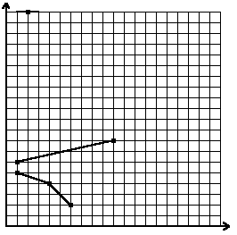

## 문제

We have a cartesian coordinate system drawn on a sheet of paper. Let us consider broken lines that can be drawn with a single pencil stroke from the left to the right side of the sheet. We also require that for each segment of the line the angle between the straight line containing this segment and the OX axis belongs to [-45°, 45°] range. A broken line fulfilling above conditions is called a flat broken line.

Suppose we are given n distinct points with integer coordinates. What is the minimal number of flat broken lines that should be drawn in order to cover all the points (a point is covered by a line if it belongs to this line)?

For 6 points whose coordinates are (1, 6), (10, 8), (1, 5), (2, 20), (4, 4), (6, 2) the minimal number of flat broken lines covering them is 3.

Write a program that:

* reads the number of points and their coordinates from the standard input;
* computes the minimal number of flat broken lines that should be drawn to cover all the points;
* writes the result to the standard output.

## 입력

In the first line of the standard input there is one positive integer n, not greater than 30,000, which denotes the number of points. In the following n lines there are coordinates of points. Each line contains two integers x, y separated by a single space, 0 ≤ x ≤ 30,000, 0 ≤ y ≤ 30,000. The numbers in the (i+1)-st line, 1 ≤ i ≤ n, are the coordinates of the i-th point.

## 출력

Your program should write exactly one integer in the first and only line of the standard output. The number should be a minimal number of flat broken lines that should be drawn in order to cover all the points.
