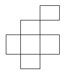
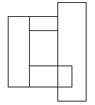

## 문제

There are n rectangles drawn on the plane. Each rectangle has sides parallel to the coordinate axes and integer coordinates of vertices. We define a block as follows:

* each rectangle is a block,
* if two distinct blocks have a common segment then they form the new block otherwise we say that these blocks are separate.

The rectangles in the first figure form two separate blocks.

The rectangles in the second form a single block

Write a program that:

* reads the number of rectangles and coordinates of their vertices from the standard input;
* finds the number of separate blocks formed by the rectangles;
* writes the result to the standard output.

## 입력

In the first line of the standard input there is an integer n, 1 ≤ n ≤ 7,000, which is the number of rectangles. In the following n lines there are coordinates of rectangles. Each rectangle is described by four numbers: coordinates x, y of the bottom-left vertex and coordinates x, y of the top-right vertex. All these coordinates are non-negative integers not greater than 10,000.

## 출력

In the first and only line of the standard output there should be written a single integer — the number of separate blocks formed by the given rectangles.
