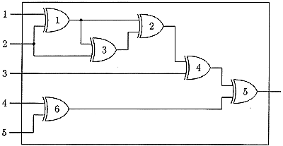

## 문제

A XOR gate has two inputs and one output. Its operation can be described by the following table

```

input 1   input 2    output
   0         0          0
   0         1          1
   1         0          1
   1         1          0
```

A system of XOR gates is called a XOR net if it has n inputs and one output and meets the following conditions:

1. Each input of the net is connected to at least one input of a gate.
2. Each input of a gate in the net is connected to one input of the net or one output of another gate.
3. The output of exactly one gate is connected to output of the net.
4. Each output of a gate in the net is connected to at least one input of another gate, or to the output of the net.
5. There exists a numbering of gates such that for every gate each of its inputs is connected to the input of the net or to the output of a gate with a smaller number.



The net of 6 gates is shown in the figure. It has 5 inputs and 1 output and meets conditions 1–5 so it is a XOR net. Observe that the numbers given in the figure do not agree with the fifth condition but there exists an appropriate numbering.

Inputs of a net are numbered from 1 to n. An input state of a XOR net can be described by an input word of the length n. Each letter of such a word is a binary digit 0 or 1. We assume that i-th digit of the word is a state of the i-th input of the net. For every input state the net returns 0 or 1 on its output. Each input word is a binary code of a natural number so we can order input words with respect to their values. We will test XOR nets by sending words from a fixed range to its input and counting the number of digits 1 returned on the output of the net.

Write a program that:

* reads the description of a XOR net from the standard input; the descriptions consists of: the number of inputs n, the number of gates m, the number of the gate connected to the output of the net and descriptions of connections;
* reads from the same file two binary words of length n — lower and upper limit of the range in which we will test the net;
* computes for how many inputs from the given range the net returns 1 on its output;
* writes the result to the standard output.

We assume that: 3 ≤ n ≤ 100, 3 ≤ m ≤ 3,000 and that the gates of the given net are numbered from 1 to m in an arbitrary order.

## 입력

In the first line of the standard input there are three integers separated by single spaces. They are respectively: the number of inputs n of the given net, the number of gates m and the number of the gate connected to the output of the net.

In the following m lines there are descriptions of the connections between gates of the net. In the i-th line, for 1 ≤ i ≤ m, there is a description of the connections of two inputs of the i-th gate. Such a description consists of two integers from the range [-n,m] separated by a single space. If an input of the gate is connected to the k-th input of the net then the description of this connection is the negative integer -k, if this input is connected to the output of the j-th gate then it is described by the positive number j.

In the following two lines there are two n-bit words a and b. They represent lower and upper limits of the range in which we test the net. We assume that in the given range there is at most 100,000 words.

## 출력

In the standard output there should be written a single non-negative integer — the number of words from the range a ≤ s ≤ b (where < is the relation consistent with the values of binary words), for which the XOR net returns 1 on its output.
