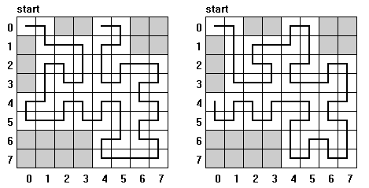

## 문제

Consider a chessboard of size 2n × 2n. Some of its squares are marked and called forbidden squares. An ant is going to visit all squares of the chessboard except the forbidden ones. Each of the squares has to be visited exactly once. The tour begins in the start square, which is the top-left square of the board and has to finish in one of the periphery squares (the ant want to leave the board in the end). We assume that the start square is not forbidden. In a single step the ant can move to one of at most four neighbouring squares (i.e. she can move up, down, left or right).

The walk of our ant is recursive in a sense: to round the square of size 2k × 2k the ant splits it into four parts (quarters) of size 2k-1 × 2k-1 and then rounds each of them. It means if the ant enters one of the quarters she cannot leave it before visiting all the squares in this quarter that are not forbidden.

In the figure you can see two routes of a recursive tour of the ant on the board of size 23 × 23. Both routes begin in the start square (0, 0). First of them is finished in the top periphery and the second in the left periphery of the board.

Write a program that:

* reads positive integers n and m from the standard input; n describes the size of the board 2n × 2n, m is the number of forbidden squares; then reads coordinates of all forbidden squares,
* for each of the four peripheries of the board finds a square at which a recursive tour described before can be finished or states that such a square does not exist;
* writes the result to the standard output.

Note: each of the four squares in the corners of the board belongs to two peripheries.

## 입력

In the first line of the standard input there is one positive integer n, n ≤ 30. In the second line there is the number of forbidden squares m, m ≤ 50.

In each of the following m lines there is a pair of non-negative integers i, j separated by a single space; i and j are coordinates of a forbidden square (i is the number of line and j is the number of column). The lines and columns of the board are numbered from 0 to 2n - 1. The top-left square has coordinates (0, 0).

## 출력

In each of four consecutive lines of the standard output there should be written two non-negative integers separated by a single space. These integers should be coordinates (the number of line and column) of the end square of an appropriate tour. If such a square does not exists the word `NIE` (which means “no” in Polish) should be written. In the first line there should be the square of the tour ending on the top periphery, in the second — on the right periphery, in the third — on the bottom periphery and in the fourth line — on the left periphery.
