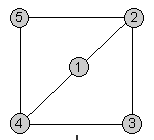

## 문제

King Informaticus, a ruler of Byteland has a lot to worry about. Secret service informed him that a cruel King Hacker is about to attack his kingdom. Moreover, secret agents of Hacker have been already sent to one of the cities in Byteland in order to hinder preparations for defense. Informaticus decided to warn his subjects against an oncoming danger.

Citizens of Byteland live only in cities. Cities have numbers from 1 to n, where 3 ≤ n ≤ 500. The capital city has number 1. There is a well developed system of roads in Byteland, all of them are two-way roads. Any two cities have no more than one direct connection, but for any two different cities A and B one can get from A to B and then return from B to A without going again through any of the cities on the way from A to B.

King Informaticus decided to send two messengers to warn his subjects. Each messenger moves on the roads of Byteland and may visit one city a couple of times. But the order in which they arrive to certain cities for the first time should be in accord with King's plan.

The plan is a series of n integers x1, x2, ..., xn from the interval [1..n], where x1 = 1. On the way from the city xi to the city xi+1 an agent can go through any finite number of cities, but only these that he had visited before. Unfortunately, spies of King Hacker sat a trap to catch the messengers and imprison any of them who comes to the occupied city. Thus the plan of routes of two messengers should be such that each city is visited by at leas one messenger, before they will be captured by agents hidden in one of the cities different than the capital.

Write a program that:

* reads from the standard input an integer n — the number of all the cities in Byteland, an integer d — the number of all the roads directly connecting two different cities as well as descriptions of all direct road connections,
* prepares plans of the routes of two messengers beginning in the capital city and then proceeding in such a way that each city in Byteland is visited by at least one messenger before spies of Hacker capture them,
* writes these plans to the standard output.

## 입력

In the first line of the standard input one integer n is written. This is the number of all the cities in Byteland. In the second line one integer d is written. This is the number of all the direct road connections. In each of the following d lines there is written the description of one direct road connection, it consists of two different integers from the interval [1..n] separated by a single space. Each connection appears only once in the text file.

## 출력

In the first line of the standard output there should be written the plan of the route of the first messenger as a series of n different integers from the interval [1..n], separated by a single space. In the second line there should be written, in the same way, the plan of the route of the second agent.

## 힌트

