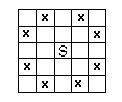

## 문제

A knight attacks squares on the chess-board as is show in the following figure (the knight on the square S attacks squares marked by a cross).

There is a chess-board of dimensions 3 × n, with 3 rows and n columns, where 1 ≤ n ≤ 100, and there is a set Z of fields on the chess-board. The rows are numbered from the top to the bottom with numbers from 1 to 3, the columns from the left to the right with numbers from 1 to n.

Knights can be put only on the squares not from the set Z and no two of them can attack each other. We assume that in each column at most one field belongs to the set Z. Thus the set Z may be described with a series: k1, k2, ..., kn, where ki ∈ {0, 1, 2, 3}. If ki = 0 then no field in the i-th column belongs to the set Z, else ki is a number of a row of the only field in this column, which belongs to Z.

Write a program that:

* reads from the standard input the number of columns on the chess-board n and the description of the set Z,
* computes the maximal number of knights M, that may be put on the chess-board according to the given rules, and L — the number of possible arrangements of M knights on this chess-board,
* writes the results to the standard output.

## 입력

In the first line of the standard input there is written one positive integer n, n ≤ 100. This is the number of columns in the chess-board. In each of the following n lines there is written one number form the set {0, 1, 2, 3}. These are the consecutive terms of the series describing the set Z.

## 출력

In the standard output two integers M and L separated by a single space should be written.
