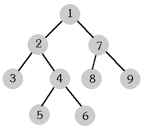

## 문제

Trees occur very often in computer science. As opposed to trees in nature, computer science trees "grow upside down"; the root is up and the leaves are down.

A tree consists of elements named nodes. A root is one of the nodes. Each node w (except for the root) has its (exactly one) father v. If the node v is the father of w, then w is a son of v. Nodes that have no sons are called leaves. Sons of the node w, their sons, sons of their sons, and so on, are called descendants of the node w. Every node - except for the root - is a descendant of the root.

Each node has a level number assigned to it. The level number of the root is 0, and the level number of sons is greater by 1 then that of their father.

A tree is a complete binary tree if and only if each node has exactly two or zero sons. In binary trees sons are named left and right.

The following picture shows an example of a complete binary tree. The nodes of that tree are numbered in a special order called preorder. In this order the root has the number 1, a father precedes its sons, and the left son and any its descendant have smaller numbers than the right son and every its descendant.

There are many written representations of complete binary trees having such numbering of nodes. Three ones follow.

**Genealogical representation.**  
It is a sequence of numbers. The first element of the sequence equals 0 (zero), and for j > 1, the j-th element of the sequence is the number of the father of the node j.

**Bracket representation.**  
Each node corresponds to a string composed of brackets. Leaves correspond to (). Each other node w corresponds to a string (lr), where l and r denote the strings that left and right sons of w respectively correspond to. The string the root corresponds to is the bracket representation of the tree.

**Level representation.**  
It is a sequence of level numbers of successive tree leaves (according to the assumed numbering).

The tree in the picture may be described as follows:

|  |  |
| --- | --- |
| Genealogical representation | `0 1 2 2 4 4 1 7 7` |
| Bracket representation | `((()(()()))(()()))` |
| Level representation | `2 3 3 2 2` |

Write a program that reads from the standard input a sequence of numbers and examines whether it is the level representation of a complete binary tree. If not, the program writes one word `NIE` ("no") in the standard output. If so, the program finds two other representations of this tree (genealogical and bracket ones), and writes them in the standard output.

## 입력

In the first line of the standard input there is a positive number of the sequence elements (not greater than 2500). In the second line there are successive elements of the sequence separated by single spaces.

The numbers in the standard input are written correctly. Your program need not verify that.

## 출력

The standard output should contain:

* either only one word `NIE`,
* or in the first line - the consecutive elements of the genealogical representation, separated by single spaces; in the second line - the bracket representation, i.e. a sequence of left and right brackets with no spaces between them.
