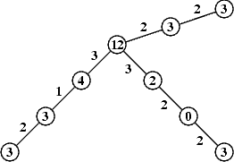

## 문제

The authorities of the Holypolygons association, to celebrate the tenth anniversary of the memorable first rally of its members on the common of Mudstock, have decided to organize a grand festival Mudstock Bis.

The members of the association live in many small settlements of Holypolyland lying along ℓ railway lines (where 1 ≤ ℓ ≤ 350) numbered by successive integers from 1 to ℓ. No line length exceeds 500 km. All the lines start in the capital and run radially from the capital to the provinces. Those lines do not cross. Each settlement except the capital lies on exactly one line. There is a positive number of settlements, not greater than 100, along each line. The number of the association's members in one settlement also does not exceed 100.

Each settlement (not being the capital) is unambiguously identified by a pair of coordinates (k, n), where k is the number of the line it lies on, and n is the number of the settlement on the line. The settlements on each line are numbered successively from the capital. We assume the capital (which is the beginning of every line) has the coordinates (0, 0).

The authorities of the association fund a train ticket for the trip back home from the festival to every member. The price of the ticket equals the number of kilometres travelled. There has arisen the problem where the festival should be organized to minimize the cost of the railway trip back home of all the association's members.

Write a program that:

* reads from the standard input data describing the railway network: the number of railway lines, the number of the association's members living in the capital, and for every settlement - the number of members living there and the length of the railway line segment from that settlement to the nearest station towards the capital,
* finds a settlement the festival should be organized in to minimize the cost of the railway trip back home of all the participants (the association's members).
* computes this minimal total cost of the railway trips,
* writes the results in the standard output.

If for many settlements the total costs of all the association's members railway trip back home from those settlements are minimal, then your program should find only one such a settlement.

## 입력

In the first line of the standard input there are two integers: the number of railway lines ℓ (1 ≤ ℓ ≤ 350) and the number of the members living in the capital of the country m (0 ≤ m < 100).

In the following ℓ lines of the file there are descriptions of the railway lines of successive numbers from 1 to ℓ. Each description has a form of a sequence of integers separated by single spaces.

First, there is a positive number of settlements lying on the given line (not counting the capital). Each consecutive pair of numbers comprises: a positive distance of the successive settlement on the given line from the closest settlement towards the capital and a nonnegative number of the association's members living in this settlement. The last number of each description is directly followed by end-of-line character.

The data in the standard input are written correctly, and your program need not verify that.

## 출력

The first line of the standard output should contain the minimal total cost of all the association members' trip by train back home from the festival. The second line should contain the coordinates of the settlement the festival should be organized in.

## 힌트

