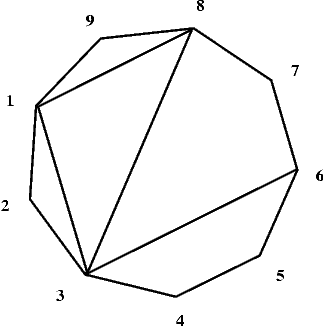

## 문제

We are given a convex polygon P of n sides (where 3 < n ≤ 5,000) and k its distinct diagonals not crossing one another inside the polygon. (The only point that two distinct diagonals may share is a vertex of the polygon.) Vertices of the polygon are numbered successively from 1 to n counterclockwise. All the diagonals divide P into smaller convex polygons whose interiors do not intersect.

Four diagonals: 1-8, 8-3, 3-1 and 3-6 divide the polygon P shown in the picture below into two quadrilaterals and three triangles.

Write a program that:

* reads a description of the polygon P and its diagonals from the standard input,
* calculates the maximal number of sides of a polygon among the polygons created by the division of P by the given diagonals,
* writes the result in the standard output.

## 입력

In each line of the standard input two positive integers separated by a single space are written.

In the first line there is the number of vertices n of the polygon and the number of diagonals k.

In each of the following k lines there is a description of one diagonal of the polygon in the form of a pair of positive integers. These integers are the numbers of the vertices of the polygon the diagonal joins. Just after the second number there is the end of the line.

The data in the standard input are written correctly and your program need not verify that.

## 출력

In the standard output one should write one positive integer - the maximal number of sides of a convex polygon created by the division of the given polygon P.
