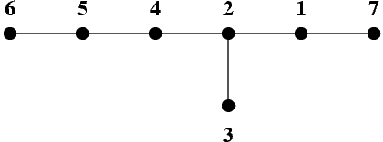

## 문제

A graph is a pair (V, E), where V is a finite set of elements called vertices of the graph, and E is a subset of the set of all unordered pairs of distinct vertices. The elements of the set E are called edges of the graph. If for each pair of distinct vertices u, v there exists exactly one sequence of distinct vertices w0, w1, ..., wk, such that w0 = u, wk = v and the pairs {wi, wi+1} ∈ E for i = 0, ..., k-1, then the graph is called a tree. We say that the distance between the vertices u and v in the tree is k.

It is known that a tree of n vertices has exactly n - 1 edges. A tree T whose vertices are numbered from 1 to n can be unambiguously described by giving the number of its vertices n, and an appropriate sequence of n - 1 pairs of positive integers describing its edges.

Any permutation of vertices - i.e. a sequence in which each vertex appears exactly once - is called a traversing order of a tree. If the distance of each two consecutive vertices in some order of the tree T is at most c, then we say that it is a traversing order of the tree with step c.

It is known that for each tree its traversing order with step 3 can be found.

The picture shows a tree of 7 vertices. The vertices are represented by black dots, and edges by line segments joining the dots.

This tree can be traversed with step 3 by visiting its vertices in the following order: 7 2 3 5 6 4 1.

Write a program that:

* reads a description of a tree from the standard input.
* finds an arbitrary traversing order of that tree with step 3,
* writes that order in the standard output.

## 입력

* In the first line of the standard input there is a positive integer n, not greater than 5,000 - it is the number of vertices of the tree.
* In each of the following n - 1 lines there is one pair of positive integers separated by a single space and representing one edge of the tree.

## 출력

In the successive lines of the standard output one should write the numbers of the successive vertices in a traversing order of the tree with step 3 - each number should be written in a separate line.
