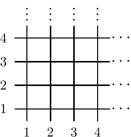
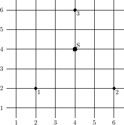

## 문제

The streets of the New Byte City form a rectangular grid - those running east-west are simply called streets, while those running north-south are called avenues. To avoid mistakes, we shall call them h-streets and v-streets, respectively. The v-streets are numbered from 1 to 500,000,000 eastwards. Similarly, the h-streets are numbered from 1 to 500,000,000 northwards. Every v-street crosses every h-street and, conversely, every h-street crosses every v-street. The distance between two consecutive v-streets, as well as between two consecutive h-streets, is exactly one kilometre.

There are k shops in the city, each one of them is situated at a crossroads. Byteasar, the merchant, supplies every single one of the k shops, and furthermore he returns to some of them several times a day with fresh supplies. Recently he has decided to have a warehouse built, from which the goods would be delivered. For obvious reasons, it should stand at a crossroads. The lorry loaded with goods can supply only one shop per course - it leaves the warehouse, delivers to the shop and returns to the warehouse. The lorry always picks the shortest path from the warehouse to the shop, and the shortest one back (possibly the same one). The distance between points (xi,yi) and (xj,yj) equals max{|xi-xj|,|yi-yj|}.

Write a programme that:

* reads the locations of shops, as well as the numbers of their daily deliveries, from the standard input
* determines such a warehouse's position that the summary distance of the lorry's daily route is minimal,
* writes the result to the standard output.

## 입력

The first line of the standard input contains one integer n (1 ≤ n ≤ 100,000), the number of shops in the New Byte City.

The following n lines contain the shops' descriptions. The (i+1)’th line contains three integers xi, yi and ti (1 ≤ xi,yi ≤ 500,000,000, 1 ≤ ti ≤ 1,000,000), separated by single spaces. This triple means that the 'th shop lies at the crossing of xi’th v-street and yi’th h-street and the lorry delivers goods to this shop ti times a day.

## 출력

The first and only line of the standard output should contain two integers xm and ym, separated by a single space, denoting the optimal position of the warehouse as the crossroads of the xm’th v-street and the ym’th h-street. Should there be many optimal solutions, your programme is to pick one of them arbitrarily.

## 힌트

The picture below illustrates the example. The numbered points are the shops. The point  is the optimal position of the warehouse.  

