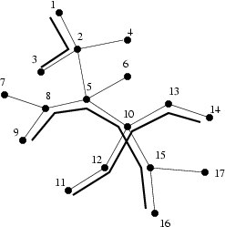

## 문제

A certain city has been coping with subway construction for a long time. The finances have been mismanaged and the costs have been underestimated to such extent that no funds were foreseen for the purchase of trains. As a result, too many stations and only some of the planned tunnels have been built - barely enough to allow a connection between any two stations to exist. The number of tunnels (each of them is bidirectional) is one less than the number of stations built. From the remaining funds only a handful of trains have been acquired.

To save their face, the board of directors have asked you to plan subway routes in such a way as to allow maximal number of stations to be connected. Each train travels on a specified route. The routes cannot branch (no three tunnels starting at a single station may belong to the same route). Distinct routes may comprise the same station or tunnel.

Write a programme which:

* reads a description of the tunnel system and the number of subway lines, which are to be planned from the standard input,
* calculates the maximal number of stations which can be covered by the specified number of subway lines,
* writes the outcome to the standard output.

## 입력

The first line of the standard input contains two integers n and l (2 ≤ n ≤ 1,000,000, 0 ≤ l ≤ n) separated by a single space. n denotes the number of stations and l denotes the number of subway lines, which are to be planned. The stations are numbered from 1 to n.

Each of the following n-1 lines contains two distinct integers separated by a single space. The numbers 1 ≤ ai,bi ≤ n in the (i+1)’th line denote the numbers of stations connected by i’th tunnel.

## 출력

The first and only line of the standard output should contain a single integer denoting the maximal number of stations which can be covered by train routes.

## 힌트

The figure represents the tunnel system (with subway routes marked) in one of the optimal configurations.
