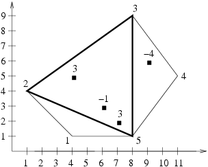

## 문제

And so it has come - the Triangles have invaded Byteotia! Byteotia lies on an island, occupying its entire surface. The shape of the island is a convex polygon (i.e. a polygon whose each inner angle is smaller than 180°). A certain number of software factories are located in Byteotia, each of which generates constant gains or losses.

The Triangles have decided to occupy such a part of Byteotia which:

* is a triangle-shaped area, the vertices of which are three different vertices of the polygon-island,
* brings the largest income i.e. the sum of all gains and losses generated by factories within the occupied area is maximal.

We assume that a factory located on the border or in the vertex of occupied area belongs to that area. A territory which contains no factory brings, obviously, a zero income.

Byteasar, the King of Byteotia, is concerned by the amount of losses the Triangles' invasion could generate. Help him by writing a programme which shall calculate the sum of gains and losses generated by factories which the Triangles wish to capture.

Write a programme which:

* reads a decription of Byteotia's shape and the locations of factories from the input file,
* determines the maximal value of sum of all gains and losses generated by factories within a triangle, whose vertices are three different vertices of the polygon island,
* writes the outcome to the output file.

## 입력

The first line of the input file contains a single integer n (3 ≤ n ≤ 600), denoting the number of vertices of the polygon-island. The following n lines of the input contain two integers each xi and yi (-10,000 ≤ xi,yi ≤ 10,000), separated by a single space, denoting the coordinates x and y of consecutive vertices of the island, in a clockwise order. The n+2-nd line contains a single integer m (1 ≤ m ≤ 10,000), denoting the total number of factories. In each of the following m lines there are three integers x’i, y’i and wi (-10,000 ≤ x’i,y’i ≤ 10,000, -100,000 ≤ wi ≤ 100,000), separated by single spaces, denoting: the coordinates x and y of the i-th factory and the gain (for wi ≥ 0) or loss (for wi < 0) this factory generates, respectively. Each factory is situated on the polygon-island i.e. within or on the border of it. Distinct factories may be located in the same place i.e. have the same coordinates.

## 출력

The first and only line of the output file should contain a single integer denoting the maximal value of sum of all gains and losses generated by factories within a triangle whose vertices are three different vertices of the polygon-island. Notice that it may happen that the outcome is a negative integer.

## 힌트

