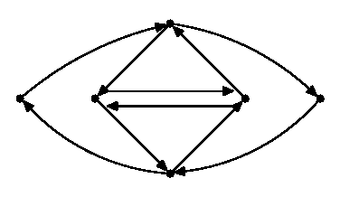

## 문제

Each morning Byteasar the Postman has to visit every street of his district and deliver the mail. All of the roads are one-way and are connected by the (pairwise distinct) crossroads. A pair of crossroads may be connected by two roads at the most: one for each of the opposing directions. The crossroads are numbered from 1 to n.

Byteasar starts and ends each route in Byteotian Post headquarters, by the first crossroads. For as long as it can be remembered Byteasar had been choosing his route by himself, but recently the board of directors has issued a new regulation, limiting the freedom of choice of the routes. Each postman has been assigned a collection of route fragments - a set of sequences of crossroads. Byteasar has to choose such a route which:

* leads down each street once only,
* comprises each of the assigned sequences (as a consistent subsequence),
* starts and ends by the first crossroads.

Unfortunately, it is possible that the board of directors issued a regulation, for which a route satisfying the requirements does not in fact exist (it requires in one of its sequences that a road be taken, which does not exist, for instance). Help Byteasar and write a programme which verifies if a correct route exists and finds it if it does.

Write a programme which:

* reads from the input file a description of the streets and assigned sequences,
* verifies if it is possible for Byteasar to get around his district in such a way as to allow him to visit each street exactly once and to fulfill the directors' assigment,
* writes the route found to the output file or concludes that such a route does not exist.

## 입력

The first line of the input file contains two integers n and m separated by a single space, 2 ≤ n ≤ 50,000, 1 ≤ m ≤ 200,000, denoting the number of crossroads and roads, respectively. The following m lines contain the descriptions of the roads: two integers a, b, separated by a single space, 1 ≤ a,b ≤ n, a≠b, denote a one-way road from the crossroads a to b. Each (ordered) pair a,b appears in the data once at the most. In the following line there is an integer t, 0 ≤ t ≤ 10,000, denoting the number of assigned sequences. The successive t lines contain the descriptions of these sequences. A description consists of an integer k, 2 ≤ k ≤ 200,000, and a sequence k of crossroads' numbers. The numbers in a line are separated by single spaces. The total length of all of the sequences does not exceed 1,000,000.

## 출력

Your programme should write in the first line of the output file:

* TAK (i.e. yes in Polish) - if a route satisfying the requirements of the task exists,
* NIE (i.e. no in Polish) - if such a route does not exist.

Should the answer be TAK, the following lines should contain a description of the route found. Should more such routes exists, write out any of them. The description consists of the sequence of crossroads the postman visits while on his route - m+1 numbers: v1,…,vm+1, each written out in a separate line, such that:

* v1=vm+1=1,
* vi and vi+1 (for 1 ≤ i ≤ m) are connected by a street,
* each street appears on the list once only,
* the route comprises, as a consistent subsequence all of the sequences imposed by the board of directors.

## 힌트

