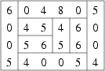

## 문제

Byteasar, the farmer, wants to plough his rectangular field. He can begin with ploughing a slice from any of the field's edges, then he can plough a slice from any unploughed field's edges, and so on, until the whole field is ploughed. After the ploughing of every successive slice, the yet-unploughed field has a rectangular shape. Each slice has a span of 1, and the length and width of the field are the integers n and m.

Unfortunately, Byteasar has only one puny and frail nag (horse) at his disposal for the ploughing. Once the nag starts to plough a slice, it won't stop until the slice is completely ploughed. However, if the slice is to much for the nag to bear, it will die of exhaustion, so Byteasar has to be careful. After every ploughed slice, the nag can rest and gather strength. The difficulty of certain parts of the field varies, but Byteasar is a good farmer and knows his field well, hence he knows every part's ploughing-difficulty.

Let us divide the field into m x n unitary squares - these are called tiles in short. We identify them by their coordinates (i,j), for 1 ≤ i ≤ m and 1 ≤ j ≤ n. Each tile has its ploughing-difficulty - a non-negative integer. Let ti,j denote the difficulty of the tile which coordinates are (i,j). For every slice, the sum of ploughing-difficulties of the tiles forming it up cannot exceed a certain constant k - lest the nag dies.

A difficult task awaits Byteasar: before ploughing each subsequent slice he has to decide which edge of the field he'll plough, so that the nag won't die. On the other hand, he'd like to plough as few slices as possible.

Write a programme that:

* reads the numbers k, m and n from the input, as well as the ploughing-difficulty coefficients,
* determines the best way to plough Byteasar's field,
* writes the result to the output.

## 입력

There are three positive integers in the first line of the input: k, m and n, separated by single spaces, 1 ≤ k ≤ 200,000,000, 1 ≤ m,n ≤ 2,000. In the following n lines there are the ploughing-difficulty coefficients. The line no. j+1 contains the coefficients t1.j,t2.j,…,tm.j, separated by single spaces, 0 ≤ ti.j ≤ 100,000.

## 출력

Your program should write one integer to the output: the minimum number of slices required to plough the field while satisfying the given conditions. Since we care for animals, we guarantee that the field can be ploughed according to the above rules. But remember, saving the nag is up to you!

## 힌트

The illustration above shows the optimal ploughing of the field from the example.
