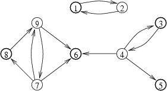

## 문제

Little Sophie gives a birthday party. She has written a tentative list of her kindergarten friends she would like to invite. However, kids are very demanding guests. Mary said she should come, but only provided Camille and Emily are not present, for they took her doll last week. Little Christopher only plays with Sophie and Camille and he does not wish to see any other kids at the party. And so on...

Sophie considers a party a success if none of the guests invited has objection against any other's presence. She has decided not to invite certain kids to assure that the party is a success. On the other hand she would like to invite as many kids as possible. Should Sophie not be able to invite at least k kids she won't give any party at all.

Help little Sophie! Write a programme which:

* reads the number of all Sophie's acquaintances n, the number k and a description of kids' demands from the standard input,
* verifies if it is possible to invite at least k kids so that the party could be a success,
* if it is not possible, writes the word NIE (i.e. no in Polish) to the standard output; if it is possible, finds the largest group of kids who could be invited to the party so that it is a success and writes it to the standard output.

## 입력

The first line of the standard input contains two positive integers separated by a single space: n - the number of all Sophie's acquaintances (2 ≤ n ≤ 1,000,000) and k - the minimal number of kids Sophie wishes to invite to the party (n-10 ≤ k < n). The kids are assigned numbers from the range 1 to n.

The following lines contain a description of kids' demands. In the second line there is a single integer m, 1 ≤ m ≤ 3,000,000. Each of the following m lines contains a pair of integers a, b, separated by a single space (1 ≤ a,b ≤ n, a≠b). You can assume that each (ordered) pair appears in the standard input once at the most. The pair a, b denotes that the child a does not wish to meet child b at the party.

## 출력

If it is not possible to invite k kids to the party so that it is a success then the first and only line of the standard output should contain a single word: NIE.

If it is possible, then the first line of the standard input should contain a single integer - the maximal number of kids that can be invited to the party so that it is a success. The second line of the standard output should contain the numbers of kids to be invited, separated by single spaces, in increasing order. Should there be more correct answers your programme should write out any one of them.

## 힌트

