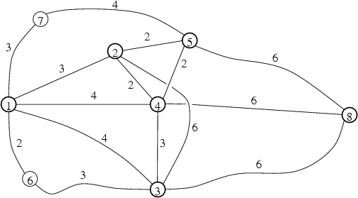

## 문제

Byteasar travels from Bitingham to Byteburg. He wants to visit some must-see sites along the way, including some interesting monuments, fine restaurants, and numerous other tourist attractions. The order, which he visits the places in, is not entirely unimportant. For example, Byteasar would rather not climb the peaky tower of the Bitfork Castle right after a lavish dinner in Digitest, and, likewise, he would drop in to Zip City (called by some Sip City) for a cup of the famous Compresso coffee after dinner, rather than before. Luckily, his tour is, to some extent, flexible and he can choose between some orders. As a result of horrendous petrol prices, he'd like to follow the shortest possible route, for economy's sake. Be a good friend and help him determine the length of the shortest path that meets his requirements.

The system of roads consists of n sites and m roads connecting them. The sites are numbered from 1 to n, and so are the roads (from 1 to m). Each road links a pair of different sites and is bidirectional. Different roads meet only at sites (which are their endpoints) and do not cross outside the sites, thanks to a clever system of flyovers and tunnels. Each road has a certain length. A pair of sites can be connected directly by at most one road, though there can be many paths consisting of at least two direct roads between them.

Let k denote the number of sites Byteasar wants to visit. Bitingham has number 1 in the numbering, Byteburg has number n, and the sites Byteasar wants to visit have numbers 2,3,…,k+1.

An exemplary system of roads is shown in the figure. Suppose Byteasar wants to visit the sites 2, 3, 4 and 5, and he would like to visit 2 before 3, and 4 and 5 after 3. Then the shortest route leads through sites 1, 2, 4, 3, 4, 5, 8 and its length is 19.

Note that the site 4 appears on the route both before and after the site 3. It is perfectly OK and means that Byteasar will not stop there before visiting site 3, since his requirements disallow it. He is, however, allowed to pass through the site 4 without stopping before visiting the site 3 - and this is exactly what he is going to do!

Write a programme that:

* reads from the standard input the description of the system of roads, the list of sites which Byteasar has chosen to visit and the restrictions regarding the order in which he wants to visit them,
* determines length of the shortest route leading in an appropriate order through all the chosen sites,
* writes the result to the standard output.

## 입력

In the first line of the standard input there are three integers n, m and k, separated by single spaces, 2 ≤ n ≤ 20,000, 1 ≤ m ≤ 200,000, 0 ≤ k ≤ 20; furthermore, inequality k ≤ n-2 holds.

The following m lines contain the descriptions of the roads, exactly one in each line. The (i+1)’th line contains three integers pi, qi and li, separated by single spaces, 1 ≤ pi < qi ≤ n, 1 ≤ li ≤ 1,000.These numbers denote a road linking the sites pi and qi of length li. You can safely assume that for each set of test data it is possible to get from Bitingham to Byteburg and each of the sites Byteasar wants to visit.

In the (m+1)’th line there is one integer g, (0 ≤ g ≤k⋅(k-1)/2}). It is the number of restrictions regarding the order in which Byteasar wants to visit the sites of his selection. These restrictions are given in the following g lines, one in each line. The (m+i+1)’th line contains two integers ri and si separated by a single space, 2 ≤ ri ≤ k+1, 2 ≤ si ≤ k+1, ri≠si. The pair ri and si means that Byteasar wants to visit the site ri before visiting the site si. It does not, however, prevent him from passing through si before visiting ri nor passing through ri after having visited si. He is free to do so, as long as he does not stop by and visit the tourist attractions. It is guaranteed that for each set of test data at least one order of visiting the selected sites while satisfying all the restrictions exists.

## 출력

In the first and only line of the standard output one integer should be written, i.e. the length of the shortest path from Bitingham to Byteburg passing in a proper order through all the sites Byteasar has selected.
