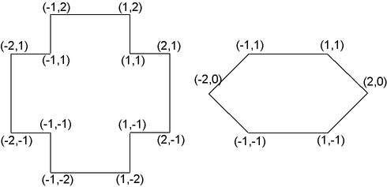

## 문제

Little Johnny - a well-respected young mathematician - has a younger sister, Justina. Johnny likes his sister very much and he gladly helps her with her homework, but, like most scientific minds, he does mind solving the same problems again. Unfortunately, Justina is a very diligent pupil, and so she asks Johnny to review her assignments many times, for sake of certainty. One sunny Friday, just before the famous Long May Weekend1 the math teacher gave many exercises consisting in finding the axes of symmetry of various geometric figures. Justina is most likely to spend considerable amount of time solving these tasks. Little Johnny had arranged himself a trip to the seaside long time before, nevertheless he feels obliged to help his little sister. Soon, he has found a solution - it would be best to write a programme that would ease checking Justina's solutions. Since Johnny is a mathematician, not a computer scientist, and you are his best friend, it falls to you to write it.

Write a programme that:

* reads the descriptions of the polygons from the standard input,
* determines the number of axes of symmetry for each one of them,
* writes the result to the standard output.

## 입력

In the first line of the input there is one integer t (1 ≤ t ≤ 10) - it is the number of polygons, for which the number of axes of symmetry is to be determined. Next, t descriptions of the polygons follow. The first line of each description contains one integer n (3 ≤ n ≤ 100,000) denoting the number of vertices of the polygon. In each of the following n lines there are two integers x and y (-100,000,000 ≤ x,y ≤ 100,000,000) representing the coordinates of subsequent vertices of the polygon. The polygons need not be convex, but they have no self-intersections - any two sides have at most one common point - their common endpoint, if they actually share it. Furthermore, no pair of consecutive sides is parallel.

## 출력

Your programme should output exactly t lines, with the k’th line containing a sole integer  nk - the number of axes of symmetry of the k’th polygon.

## 힌트

1. In Poland, there is an accumulation of public and national holidays in the beginning of May. Those are: 1st May - May Day, the International Workers' Day, 2nd May - the Day of the Polish Flag, 3rd May - the Anniversary of Establishment of the First Constitution of Poland (dating back to the year 1795); Though the middle, quite recent, feast is not actually a holiday, it is, however, customary to make it a day out of work too. Now imagine that 1st May is on Monday or 3rd May on Friday and you will get the feeling what the Long May Weekend is!
