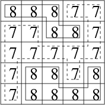
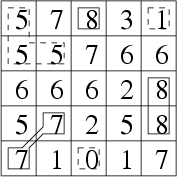

## 문제

Byteasar loves trekking in the hills. During the hikes he explores all the ridges and valleys in vicinity. Therefore, in order to plan the journey and know how long it will last, he must know the number of ridges and valleys in the area he is going to visit. And you are to help Byteasar.

Byteasar has provided you with a map of the area of his very next expedition. The map is in the shape of a n x n square. For each field (i,j) belonging to the square (for i,j ∈ {1,…,n}), its height w(i,j) is given.

We say two fields are adjacent if they have a common side or a common vertex (i.e. the field (i,j) is adjacent to the fields (i-1,j-1), (i-1,j), (i-1,j+1), (i,j-1), (i,j+1), (i+1,j-1), (i+1,j), (i+1,j+1), provided that these fields are on the map).

We say a set of fields S forms a ridge (valley) if:

* all the fields in S have the same height,
* the set S forms a connected part of the map (i.e. from any field in S it is possible to reach any other field in S while moving only between adjacent fields and without leaving the set S),
* if s ∈ S and the field s’∉ S is adjacent to s, then ws > ws’ (for a ridge) or ws < ws’ (for a valley).

In particular, if all the fields on the map have the same height, they form both a ridge and a valley.

Your task is to determine the number of ridges and valleys for the landscape described by the map.

Write a programme that:

* reads from the standard input the description of the map,
* determines the number of ridges and valleys for the landscape described by this map,
* writes out the outcome to the standard output.

## 입력

In the first line of the standard input there is one integer n (2 ≤ n ≤ 1,000) denoting the size of the map. In each of the following n lines there is the description of the successive row of the map. In (i+1)’th line (for i ∈ {1,…,n}) there are n integers w(i,1), ..., w(i,n) (0 ≤ wi ≤ 1,000,000,000), separated by single spaces. These denote the heights of the successive fields of the i'th row of the map.

## 출력

The first and only line of the standard output should contain two integers separated by a single space - the number of ridges followed by the number of valleys for the landscape described by the map.

## 힌트

The above figures show the ridges (continuous line) and the valleys (dashed line).
