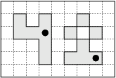

## 문제

Byteburg, the capital of Byteotia, is a picturesque city situated in a valley in the midst of mountains. Unfortunately, recent heavy rainfall has caused a flood - all the Byteburg is now completely under water. Byteasar, the king of Byteotia, has summoned his most enlightened advisors, including you, to a council. After long deliberations the council agreed to bring a few pumps, set them up in the flooded area and drain Byteburg. The king has asked you to determine the minimum number of pumps sufficing to drain the city.

You are provided with a map of the city and the valley it is situated in. The map is in the shape of a m x n rectangle, divided into unitary squares. For each such square the map tells its height above sea level and also whether it is a part of Byteburg or not. The whole area depicted in the map is under water. Furthermore, it is surrounded by much higher mountains, making the outflow of water impossible. Obviously, there is no need to drain the area that does not belong to Byteburg.

Each pump can be placed in any unitary square depicted in the map. The pump will be drawing the water until its square is completely drained. Of course, the communicating tubes principle makes its work, so draining one square results in lowering the water level or complete draining of those squares from which the water can flow down to the one with the pump. Water can flow only between squares with a common side (or, more exact, squares whose projections onto horizontal plane have a common side, since the squares may be at different level). Apart from that, the water obviously only flows down.

Write a programme that:

* reads description of the map from the standard input,
* determines the minimum number of pumps needed to drain whole Byteburg,
* writes out the outcome to the standard output.

## 입력

In the first line of the standard input there are two integers m and n, separated by a single space, 1 ≤ n,m ≤ 1,000. The following m lines contain the description of the map. The (i+1)’th line describes the i’th row of unitary squares in the map. It contains n integers xi.1, xi.2, …, xi.n separated by single spaces, -1,000 ≤ xi.j ≤ 1,000, xij ≠ 0. The number xij describes the j’th square of the i’th line. The ground level in this square is |xij| above sea level. If xij > 0, then the square is part of Byteburg, otherwise it is outside the city. Notice, that the area of Byteburg need not be connected. In fact the city may have several separate parts.

## 출력

Your programme should write out one integer to the standard output - the minimum number of pumps needed to drain Byteburg.

## 힌트

In the figure you can see the area of Byteburg and an exemplary setup of two pumps.
