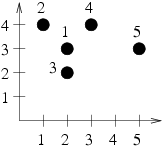
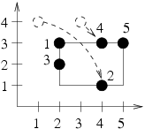

## 문제

Vicomte de Bajteaux is the owner of a renowned collection of boulders. Up to now, he has kept it in the cellars of his palace, but recently, he has decided to display the collection in his vast gardens.

The gardens have a shape of rectangle, whose sides are 1,000,000,000 units long and are parallel to east-west and north-south geographical directions. For each boulder, vicomte has determined coordinates of the point, which he would like it to be placed in (the coordinates are simply distances to the southern and western side of the garden), and gave them to his servants. Unfortunately he has forgot to tell them the order of the coordinates (i.e. for some of the boulders the first coordinate of a point is the so called “y coordinate", i.e. the ordinate, while for others the so called “x coordinate", i.e. the abscissa). The servants, unaware of this fact, have placed the boulders assuming customary coordinate ordering (as in standard Cartesian coordinates: the abscissa, commonly known as “x coordinate", first).

To protect his collection, vicomte has decided to surround it with a fence. For aesthetic reasons the fence has to be a rectangle, with sides parallel to the sides of the garden. The garden layout has been planned, so that the total length of the fence be minimal (i.e. in the space of all coordinate orderings, the original ordering of vicomte requires the minimal length of the fence - we assume that the rectangle may have sides of zero length).

The servants have to move the boulders so that the length of the fence required is minimal lest their mistake become obvious. Each boulder may only be moved in a way that preserves the coordinate set: by interchanging its coordinates. As the boulders are heavy, the servants would like to minimize their effort, by minimizing the weight of the boulders to be moved.

Write a programme which:

* reads the present positions of the boulders in the gardens and their respective weights,
* determines a sequence of moves, which minimizes the length of the fence required to protect the boulders and also minimizes the weight of the boulders to be moved,
* writes the outcome to the standard output.

## 입력

The first line of the standard input contains a single integer n (2 ≤ n ≤ 1,000,000), denoting the number of boulders in the collection. The following  lines contain three integers xi,yi, and mi each (0 ≤ xi,yi ≤ 1,000,000,000, 1 ≤ mi ≤ 2,000), separated by single spaces, denoting the present coordinates and the weight of i’th boulder. No unordered pair of coordinates will appear in the input more than once.

## 출력

The first line of the standard output should contain two integers, separated by a single space - the minimal length of fence possible and the minimal weight of the boulders to be moved in order to obtain such a length.

The second line should contain a sequence of n zeros and/or ones - i’th element of the sequence should be a one if in the optimal solution the i’th boulder is to be moved and zero otherwise. Should more than one correct solutions exist, your programme is to write out any one of them.

## 힌트

For sample input

For sample output

