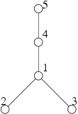

## 문제

Byteotia has been eventually touched by globalisation, and so has Byteasar the Postman, who once roamed the country lanes amidst sleepy hamlets and who now dashes down the motorways. But it is those strolls in the days of yore that he reminisces about with a touch of tenderness.

In the olden days n Byteotian villages (numbered from 1 to n) were connected by bidirectional dirt roads in such a way, that one could reach the village number 1 (called Bitburg) from any other village in exactly one way. This unique route passed only through villages with number less or equal to that of the starting village. Furthermore, each road connected exactly two distinct villages without passing through any other village. The roads did not intersect outside the villages, but tunnels and viaducts were not unheard of.

Time passing by, successive roads were being transformed into motorways. Byteasar remembers distinctly, when each of the country roads so disappeared. Nowadays, there is not a single country lane left in Byteotia - all of them have been replaced with motorways, which connect the villages into Byteotian Megalopolis.

Byteasar recalls his trips with post to those villages. Each time he was beginning his journey with letters to some distinct village in Bitburg. He asks you to calculate, for each such journey (which took place in a specific moment of time and led from Bitburg to a specified village), how many country roads it led through.

Write a programme which:

* reads from the standard input:
  + descriptions of roads that once connected Byteotian villages,
  + sequence of events: Byteasar's trips and the moments when respective roads were transformed into motorways,
* for each trip, calculates how many country roads Byteasar has had to walk,
* writes the outcome to the standard output.

## 입력

In the first line of the standard input there is a single integer n (1 ≤ n ≤ 250,000), denoting the number of villages in Byteotia. The following n-1 lines contain descriptions of the roads, in the form of two integers a, b (1 ≤ a < b ≤ n) separated by a single space, denoting the numbers of villages connected with a road. In the next line there is a single integer m (1 ≤ m ≤ 250,000), denoting the number of trips Byteasar has made. The following n+m-1 lines contain descriptions of the events, in chronological order:

* A description of the form "A a b” (for a < b) denotes a country road between villages a and b being transformed into a motorway in that particular moment.
* A description of the from "W a” denotes Byteasar's trip from Bitburg to village a.

## 출력

Your programme should write out exactly m integers to the standard output, one a line, denoting the number of country roads Byteasar has travelled during his successive trips.

## 힌트

For the sample input

