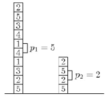

## 문제

A puzzle called "Tetris Attack" has lately become a very popular game in Byteotia. The game itself is highly sophisticated, so we shall only introduce its simplified rules: the player is given a stack of 2n elements, placed one on another and marked with n different symbols. Exactly two elements of the stack are marked with each symbol. A player's move consists in swapping two neighbouring elements, ie. interchanging them. If, as a result of the swap, there are some two neighbouring elements marked with the same symbol, they are both removed from the stack. Then all the elements that have been above them fall down in consequence and may very well cause another removals. The player's goal is emptying the stack in the least possible number of moves.

Write a programme that:

* reads the description of the initial stack content from the standard input,
* finds a solution with the minimum number of moves possible,
* writes out the outcome to the standard output.

## 입력

In the first line of the standard input there is one integer n, 1 ≤ n ≤ 50,000. The following 2n lines describe the initial content of the stack. The (i+1)’th line contains one integer ai - the symbol which the i’th (1 ≤ ai ≤ n) element from the bottom is marked with. Each symbol appears in the stack exactly twice. Moreover, no two identical symbols neighbour initially. The test data is well chosen so that a solution with no more than 1,000,000 moves exists.

## 출력

A solution with the minimum number of moves possible should be written out to the standard output as follows. The first line should contain one integer m - the minimum number of moves. The following m should describe the optimal solution itself, i.e. a sequence of m integers pi,…,pm, one in each line. pi denotes that in i’th move the player has chosen to swap the pi’th and (pi+1)’th elements from the bottom.

If more than one optimal solution exists, your programme should write out any one of them.

## 힌트

