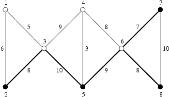

## 문제

Byteland Railways encountered a necessity of restructuring and reduction of the rail network. After a deep analysis of of the rail network it has been decided which railway stations will be removed and which ones will stay. It has been also decided that the rail network should be reduced as far as possible. It remains to choose which railway lines should be removed and which ones should stay.

The rail network is composed of rail segments connecting railway stations. It is known that from each station one can travel to every other station (potentially visiting some intermediate stations). Rail segments are bidirectional. There can be at most one rail segment connecting each pair of stations. Each segment can be assigned a cost of maintenance, which is a positive integer. The rail segments that will remain should be chosen in such way that:

* it is possible to travel between every pair of stations that are not going to be removed,
* their total cost of maintenance is low (it can be at most two times greater than the lowest cost that can be achieved, assuming that the previous condition is satisfied).

All remaining rail segments will be removed. Railway lines that will remain can run through stations that will be removed.

Write a programme which:

* reads a description of the rail network and the stations that will not be removed from the standard input,
* determines which rail segments should remain and which should be removed,
* writes out the rail segments that should remain together with the total cost of their maintenance to the standard output.

## 입력

The first line of input contains two positive integers n and m, 2 ≤ n ≤ 5,000, 1 ≤ m ≤ 500,000 (\( m ≤ \frac {n⋅(n-1)}{2} \)), separated by a single space. n denotes the number of railway stations and m is the number of rail segments. Railway stations are numbered from 1 to n. The following m lines contain descriptions of the rail segments, one per line. Each of these lines contains three positive integers a, b and u, 1 ≤ a,b ≤ n, a≠b, 1 ≤ u ≤ 100,000. a and b are the numbers of stations that are connected by the segment and u is its cost of maintenance. The (m+2)’th line contains a sequence of integers separated by single spaces. The first one of them is p - the number of stations that should remain (1 ≤ p ≤ n, p⋅m ≤ 15,000,000). It is followed by the numbers of these stations in increasing order.

## 출력

The first line of output should contain two integers c and k separated by a single space, where c is the total cost of maintenance of the segments that should remain and k is the number of these segments. Each of the following k lines should contain two integers ai and bi, separated by a single space - the numbers of stations that are connected by the segment. The total cost of maintenance of the segments can be at most two times greater than the lowest achievable total cost.

## 힌트

