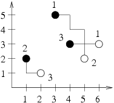

## 문제

The GasBit Concern intends to dominate the gas market in Byteotia. The experts have already marked the optimal gas extraction points and distribution stations on the Byteotian map. Now it is time to assign the distribution stations to the extraction points. Each distribution station is to be connected to exactly one extraction point and vice versa, each extraction point to exactly one station.

GasBit specializes in building gas pipelines leading from the extraction points to the distribution stations in the south or east direction - each gas pipeline built is to be (in a bird's eye view) in the shape of a broken line whose each consecutive segment leads south or east and is perpendicular to the previous one. The concern's board of directors wonders how to assign the distribution stations to the extraction points in such a way that the total length of the necessary pipelines be minimal. Crossing of pipelines is not a problem, as the colliding pipes can be put at different depths underground.

Write a programme that:

* reads from the standard input the planned locations of the gas extraction points and distribution stations,
* determines such an assignment of the distribution stations to the extraction points that allows minimal total length of necessary pipelines that have to be built to connect them,
* writes out the outcome to the standard output.

## 입력

The first line of the standard input contains one integer n (2 ≤ n ≤ 50,000), denoting the number of extraction points (equal to the number of distribution stations). The following n lines contain two integers xi and yi (0 ≤ xi,yi ≤ 100,000 for 1 ≤ i ≤ n) each, separated by a single space and denoting the coordinates of the extraction points. One moves east as x rises and moves north as y rises. The next n lines contain two integers x’j and y’j ( 0 ≤ x’j,y’j ≤ 100,000 for 1 ≤ j ≤ n) each, separated by a single space and denoting the coordinates of the distribution stations.

Both the extraction points and the distribution stations are numbered with integers from 1 to n in the order they appear in the input. No pair of coordinates appears twice in one input data set. Furthermore for each input data set there is an assignment of the distribution stations to the extraction points that can be realized by pipelines leading south or east only.

## 출력

The first line of the standard output should contain one integer denoting the minimal total length of all the gas pipelines that need to be built. Then an exemplary description of an extraction points - distribution stations assignment that attains this minimum should follow. Each of the following n lines should contain two integers separated by a single space and denoting the number of the extraction point and the number of the distribution station respectively that should be connected by a pipeline. The order of the pairs may be arbitrary. If many optimal solutions exist, your programme may write out one arbitrarily chosen.

## 힌트

