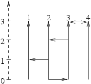
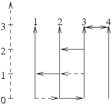

## 문제

The Byteotian driving licence exam takes place in an area in which there are n straight, parallel, unidirectional, north-oriented streets (that is the allowed driving direction is south to north). Each of the streets is exactly m meters long, all of them begin and end on the same level. These streets are numbered from 1 to n starting the westernmost. There are also p unidirectional, east or west-oriented streets perpendicular to the abovementioned, each one of them connecting a pair of adjacent north-oriented streets. It is also possible that an east-oriented and a west-oriented street overlap, thus forming a bidirectional one.

  
An exemplary testing area (n=4, m=3, p=5).

The examiner chooses a north-oriented street, at the beginnig of which the examination starts and another north-oriented street, where it is to come to an end. The task of the applicant is to drive from the starting to the final point, observing the allowed directions.

The examiner always chooses as starting point a street, from which it is possible to drive to the endpoint of any other north-oriented street.

The work of the examiners is a very tedious one, because they always have to start at the beginning of one of the few suitable streets. The board of directors have decided to build a new testing area on the basis of pre-existent plans. It has been calculated, that available funds allow for no more than k east or west-oriented streets to be built. Those new streets are to be constructed in such a way, so as to add the largest possible number of potential starting points (there may or may not exist starting points on the pre-existent plan). New streets have to connect pairs of adjacent north-oriented streets.

Write a programme which:

* reads a description of the testing area and the number k from the standard input,
* calculates the greatest number of potential new starting points for the examination, generated by adding no more than k east or west-oriented streets,
* writes the outcome to the standard output.

## 입력

In the first line of the standard input there are four integers n, m, p and k (2 ≤ n ≤ 100,000, 1 ≤ m,k ≤ 100,000, 0 ≤ p ≤ 100,000), separated by single spaces, denoting respectively: the number of north-oriented streets, the length of each one of them, the number of pre-existent east or west-oriented streets, the maximal number of new streets to be built. The north-oriented streets are numbered from 1 to n, starting with the westernmost.

The following p lines contain three integers each: n, mi and di (1 ≤ ni ≤ n, 0 ≤ mi ≤ m, di ∈ {0,1}), separated by single spaces, denoting the i’th east-oriented (for di=0) or west-oriented (for di=1) street. This street connects north-oriented streets n and n+1, intersecting them in points mi meters distant from their beginning.

## 출력

The first and only line of the standard output should contain a single integer, denoting the maximal number of new examination starting points generated by building no more than k east or west-oriented streets. The newly built streets do not have to intersect the north-oriented streets in points, whose distance from the beginning of the street is an integer. The newly built east or west-oriented streets may overlap, thus forming bidirectional streets.

## 힌트

The beginnings of streets 1 and 3 may become new starting points for the examination, for instance.
