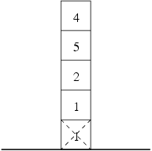
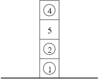

## 문제

Little Jessica received a set of building blocks for her birthday. The blocks are all cubes of the same size. Each block has a positive integer inscribed on it. As they were very much to Jessica's liking she immediately constructed a high tower out of all blocks.

Mom told Jessica that the goal of the game is to build a tower, in which as many blocks as possible are in the right places. A block with number i inscribed on it is in its proper place if it is on altitude i in the tower (the lowest block is on altitude 1, the one above it on altitude 2, etc.).

Jessica has decided to carefully (in order not to make the tower fall) remove some of the blocks, so that as many blocks as possible are in their proper places. Advise Jessica on which blocks to remove.

Write a programme which:

* reads a description of the tower Jessica has initially built from the standard input,
* determines, which blocks are to be removed,
* writes the outcome to the standard output.

## 입력

The first line of the standard input contains a single integer n (1 ≤ n ≤ 100,000), denoting the initial height of the tower. The second line contains n positive integers: a1,a2,…,an (1 ≤ ai ≤ 1,000,000), separated by single space, denoting the numbers inscribed on the blocks. The numbers are given from the lowermost to the topmost block.

## 출력

In the first line of the standard output your programme should write out the number of blocks to be removed, so as to maximize the number of blocks in their proper places. The second line should contain the numbers of the blocks to be removed (separated by single spaces). The blocks are numbered from 1 to n counting from the lowermost to the topmost block in the initial tower. Should more than one solution exist, your programme is to write out any one of them.

## 힌트

