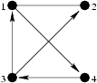

## 문제

King Byteasar has yielded under pressure of Byteotian merchants and hence decided to settle the issue of toll paid by them. Byteotia consists of n towns connected with m bidirectional roads. Each road connects directly two different towns and no two towns are connected by more than one direct road. Note that the roads may lead through tunnels or flyovers.

Until now each town in Byteotia imposed duty on everyone who either entered or left the town. The merchants, discontented with such situation, lodged a protest against multiple taxation. King Byteasar ruled that the town privileges are now restricted. According to the new royal edict, each town can only charge toll on merchants travelling by exact one road leading into the town, regardless of the direction they are travelling in. Furthermore, for each road, those who travel it cannot be made to pay the duty to both towns the road connects. It remains to determine which town should collect toll from which road. Solving this problem His Highness has commissioned to you.

Write a programme that:

* reads the Byteotian road system's description from the standard input,
* for each town determines on which road it should impose toll, or claims it is impossible,
* writes out the result to the standard output.

## 입력

There are two integers in the first line of the standard input: n and m (1 ≤ n ≤ 100,000, 1 ≤ m ≤ 200,000), denoting the number of towns and roads in Byteotia, respectively. The towns are numbered from 1 to n. In next m lines descriptions of the roads follow. In line no. i there are two integers ai and bi (1 ≤ ai < bi ≤ n) meaning that towns ai and bi are directly connected by a road.

## 출력

If collecting the toll in accordance with the royal edict is impossible, your programme should write the word NIE ('no' in Polish) in the first and only line of the standard output. Otherwise, it should write the word TAK ('yes' in Polish) in the first line, while in the following n lines should tell which city collects toll from which road. Line no. i+1 should tell on which road the town no. i imposes toll. Since town no. i is obviously one endpoint of this road, it is enough to tell what is the other endpoint. Thus if the town no. i imposes toll on the road connecting it with the town no. j, the line no. i+1 should contain the number j. If more than one solution exists, write out one chosen arbitrarily.

## 힌트

The arrows in the figure point to towns that collect toll from merchants using the road. Observe that the merchants who follow the road connecting the towns 1 and 2 are not charged with toll at all.
