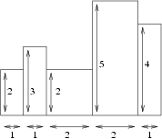
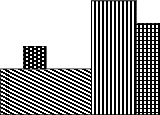

## 문제

All the buildings in the east district of Byteburg were built in accordance with the old arbitecture: they stand next to each other with no spacing inbetween. Together they form a very long chain of buildings of diverse height, extending from east to west.

The mayor of Byteburg, Byteasar, has decided to have the north face of the chain covered with posters. Byteasar ponders over the minimum number of posters sufficient to cover the whole north face. The posters have rectangular shape with vertical and horizontal sides. They cannot overlap, but may touch each other, i.e. have common points on the sides. Every poster has to entirely adjoin the walls of certain buildings and the whole surface of the north face has to be covered.

Write a programme that:

* reads the description of buildings from the standard input,
* determines the minimum number of posters needed to entirely cover their north faces,
* writes out the outcome to the standard output.

## 입력

The first line of the standard input contains one integer n (1 ≤ n ≤ 250,000), denoting the number of buildings the chain comprises of. Each of the following n lines contains two integers di and wi (1 ≤ di,wi ≤ 1,000,000,000), separated by a single space, denoting respectively the length and height of the ith building in the row.

## 출력

The first and only line of the standard output should contain one integer, the minimum number of rectangular posters that suffice to cover the north faces of the buildings.

## 힌트

For the sample input

For the sample output

The figures show the north face of the buildings chain. The second figure shows an exemplary covering of the face with four posters.
