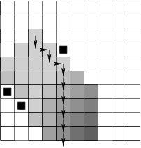

## 문제

Tossed by the storm on a deserted island, Robinson built himself a boat so that he could go out to the sea and seek out human domicile. He is an experienced sailor, therefore he built the boat with accordance to the rules of craftsmanship: it has a longitudinal axis of symmetry and an appropriate shape. The boat's prow is thin, and it widens gradually towards the boat's centre, only to gradually narrow once again towards the stern. In particular, at some point in the middle the boat is wider than both at the prow and stern.

Unfortunately, Robinson has launched his boat in a most improper space: there is extremely thick reed all around. It is, moreover, so stiff that the boat cannot break through. Perhaps Robinson can get to the high seas by carefully manoeuvring between the reed.

Due to lack of manoeuvrability, the boat can move forward and backward and even sidewards (leftward or rightward), but it cannot turn. It is thus allowed, and may be in fact necessary, that the boat moves with its stern or broadside to the front.

You are to judge if Robinson can get to the high seas.

To make your task easier the island and its surroundings will be represented by a square map divided into square unit fields, each occupied by either water, part of Robinson's boat or an obstacle, eg. land or reed. Initially the boat is set parallel to one of the cardinal directions, ie. its longitudinal axis of symmetry is parallel to this direction and the axis bisects the unit fields it is covered with.

We assume that the high seas starts where the map ends. Hence Robinson may get to the high seas if his boat can leave the area depicted in the map. A single move consists in moving the boat to a side-adjacent field in a chosen direction (north, south, east or west). The move is permissible if both before and after it the boat remains entirely in water (it does not occupy a field with an obstacle).

You are to write a programme that

* reads the map's description from the standard input,
* calculates the minimum possible number of boat's moves that suffice to completely leave the area depicted in the map,
* writes out this number to the standard output.

## 입력

The first line contains one integer 3 ≤ n ≤ 2,000 , denoting the length of the map's side. In each of the following n lines there are n characters describing successive fields of the map: ith character in the (j+1)^th line tells the contents of the field (i,j). The following characters may appear there:

* "." - (dot) denotes a field filled with water,
* "X" - denotes an obstacle (land or reed),
* "r" - denotes a part of Robinson's boat.

## 출력

Your programme should write out (in the first and only line of the standard output) a single positive integer, equal to the minimum number of boat's moves that suffice to completely leave the area depicted in the map. Should getting to the high seas be impossible, write out the word 'NIE' ('no' in Polish).

## 힌트

