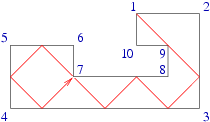
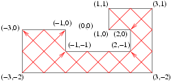

## 문제

King Byteasar's palace is haunted by a ghost. The spiteful claim it is the ghost of the late Byteasar's wife (who died recently in suspicious circumstances), for it takes great pleasure in looking at itself in the mirror, just as she did. No wonder that Byteasar would gladly get rid of this ghost!

Byteasar has decided to plant a special mirror trap in one of the palace's chambers. It is a closed, well lit room whose every interior wall is covered with mirror. Furthermore, in its every corner a laser gun or a laser detector can be set up. As soon as the ghost crosses one of the laser beams an alarm will go off, summoning Byteasar's ghost vanquishers team (as a royal team, they prefer not to be colloquially called 'ghost busters'), who will surely dispose of the ghost in no time.

The chamber, in which the mirror trap is being installed, is in the shape of a polygon whose consecutive sides are perpendicular. Moreover, the length of every side (measured in metres) is integral. Should a laser gun be installed in some corner, its beam has to be pointed along the bisector of the angle formed by the walls meeting in this corner (in a plane parallel to the floor surface). Obviously, if the laser beam encounters a mirror, it is reflected, obeying the regular reflection law: the angle which the incident ray makes with the normal is equal to the angle which the reflected ray makes to the same normal. This angle, as you may notice, is always 45 degrees due to the chamber's architecture. A beam cast along the bisector into a corner where a detector is placed, is completely absorbed by it. On the other hand, a beam cast along the bisector into corner without a detector (though possibly with a laser gun) is reflected back (by 180 degrees). In all the remaining cases the beam does not change its direction at all.

A maximum number of laser guns complemented with laser detectors should be placed in the room in such a way that each laser beam is eventually absorbed by some detector, no two laser beams are absorbed by the same detector and each detector absorbs some laser beam. Also, a laser gun and a detector may not be placed in the same corner.

An example of a mirror trap with the laser beam going from corner 1 to corner 7.

Write a programme that:

* reads from the standard input the the mirror trap's shape description,
* determines the way of setting up the maximum possible number of laser guns and detectors satisfying the aforementioned conditions,
* writes out the result to the standard output.

## 입력

In the first line of the standard input there is a single integer n (4 ≤ n ≤ 100,000). It is equal to the number of walls of the mirror trap. Each of the following  lines contains two integers: xi and yi denoting the tth corner's coordinates (1 ≤ i ≤ n, -1,000,000 ≤ xi,yi ≤ 1,000,000), separated by a single space. Every two successive corners are connected by a wall parallel to one of the axes. No two walls share a common point, except two successive walls, which have a common endpoint (some corner). The successive corners of the room are given in the clockwise order (ie. if one walks the room along the walls, one has the interior on the right-hand side). The total length of all the walls does not exceed 300,000.

## 출력

Your programme should write a single integer m in the first line of the standard output, denoting the maximum number of laser gun-detector pairs that may be set up in the mirror trap. In each of the following m lines there should be a pair of integers ai and bi separated by a single space, where ai denotes the number of the corner in which the laser gun should be placed while bi - the number of the corner in which the corresponding laser detector should be placed, satisfying 1 ≤ ai,bi ≤ n. If more than one optimal setup exists, pick one arbitrarily.

## 힌트

An exemplary deployment of laser guns and detectors in the mirror trap is depicted in the figure.
