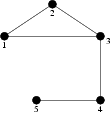

## 문제

There are exactly n towns in Byteotia. Some towns are connected by bidirectional roads. There are no crossroads outside towns, though there may be bridges, tunnels and flyovers. Each pair of towns may be connected by at most one direct road. One can get from any town to any other-directly or indirectly.

Each town has exactly one citizen. For that reason the citizens suffer from loneliness. It turns out that each citizen would like to pay a visit to every other citizen (in his host's hometown), and do it exactly once. So exactly n⋅(n-1) visits should take place. That's right, should. Unfortunately, a general strike of programmers, who demand an emergency purchase of software, is under way. As an act of protest, the programmers plan to block one town of Byteotia, preventing entering it, leaving it, and even passing through. As we speak, they are debating which town to choose so that the consequences are most severe.

Write a programme that:

* reads the Byteotian road system's description from the standard input,
* for each town determines, how many visits could take place if this town were not blocked by programmers,
* writes out the outcome to the standard output.

## 입력

In the first line of the standard input there are two positive integers: n and m (1 ≤ n ≤ 100,000, 1 ≤ m ≤ 500,000) denoting the number of towns and roads, respectively. The towns are numbered from 1 to n. The following m lines contain descriptions of the roads. Each line contains two integers a and b (1 ≤ a < b ≤ n) and denotes a direct road between towns numbered a and b.

## 출력

Your programme should write out exactly n integers to the standard output, one number per line. The ith line should contain the number of visits that could not take place if the programmers blocked the town no. i.

## 힌트

