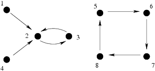

## 문제

Mob feud rages in Equatorial Byteotia. The mob bosses have come to the country's capital, Byteburg, to settle the dispute. Negotiations were very tense, and at one point the trigger-happy participants drew their guns. Each participant aims at another with a pistol. Should they go on a killing spree, the shooting will go in accordance with the following code of honour:

* the participants shoot in a certain order, and at any moment at most one of them is shooting,
* no shooter misses, his target dies instantly, hence he may not shoot afterwards,
* everyone shoots once, provided he had not been shot before he has a chance to shoot,
* no participant may change his first target of choice, even if the target is already dead (then the shot causes no further casualties).

An undertaker watches from afar, as he usually does. After all, the mobsters have never failed to stimulate his business. He sees potential profit in the shooting, but he would like to know tight estimations. Precisely he would like to know the minimum and maximum possible death rate. The undertaker sees who aims at whom, but does not know the order of shooting. You are to write a programme that determines the numbers he is so keen to know.

Write a programme that:

* reads from the standard input what target each mobster has chosen,
* determines the minimum and maximum number of casualties,
* writes out the result to the standard output.

## 입력

The first line of the standard input contains the number of participants n (1 ≤ n ≤ 1,000,000). They are numbered from 1 to n. The second line contains n integers s1,s2,…,sn, separated by single spaces, 1 ≤ si ≤ n. si denotes the number of ith participant's target. Note that it is possible that si=i for some i (the nerves, you know).

## 출력

Your programme should write out two integers separated by a single space in the first and only line of the standard output. These numbers should be, respectively, the minimum and maximum number of casualties resulting from the shooting.

## 힌트

