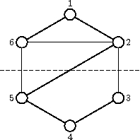

## 문제

Byteasar, king of Byteotia, has finally decided to retire. He has two sons, however, and is unable to decide which one one of them should succeed him. Therefore he plans to split the kingdom into two halves, making each son a ruler.

After the division, watchtowers have to be built along the roads connecting the halves. Obviously, building them will be costly, so ideally there should be as little roads between the halves as possible.

Luckily, Byteotia consists of an even number of towns, connected by roads. Resulting from the division, each half-kingdom should contain half the towns. Each road connects (directly) two towns. The roads do not meet nor cross outside towns, though they can lead through flyovers or tunnels. Every two towns are directly connected by at most one road.

Which exact towns should lie in which half of the kingdom is a matter of great importance. You may assume that the land outside the towns can be partitioned in such a way that the roads connecting towns lying in the same half will not cross the border. On the other hand, one watchtower has to be built by each road connecting towns from different halves.

Write a programme that:

* reads the descriptions of towns and the roads connecting them from the standard input,
* determines such a partition of kingdom into halves that both the halves contain an equal number of towns and the number of roads connecting towns lying in different halves is minimum,
* writes out the result to the standard output.

If more than one optimum partition exists, your programme should pick one of them arbitrarily.

## 입력

The first line of the standard input contains two integers n and m, separated by a single space, denoting the number of towns and number of roads respectively, 2 ≤ n ≤ 26, 2|n, \( 0 ≤ m ≤ \frac {n⋅(n-1)}{2} \). The towns are numbered from 1 to n. Each of the following m lines contains two integers separated by a single space. The line no. (i+1) (for i=1,2,…,m) contains the numbers ui  and vi, 1 ≤ ui < vi ≤ n. These denote a road connecting ui and vi.

## 출력

Your programme should write out exactly one line to the standard output. It should contain \( \frac {n}{2} \) integers separated by single spaces. These should be the numbers of towns belonging to the same half of the kingdom the town no. 1 does, in an increasing order.

## 힌트

The dashed line in the figure shows the optimum partition, which requires building as little as watchtowers.
