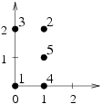

## 문제

n pairwise disjoint points in the plane are given (n ≥ 3). There are \( \frac {n⋅(n-1)⋅(n-2)}{6} \) triangles whose vertices are some pairwise different points among them (including degenerate triangles, i.e. ones whose vertices are collinear).

We want to calculate the sum of areas of all the triangles with vertices in the given points.

Those parts of the plane that belong to many triangles are to be calculated multiple times. We assume that the area of degenerate triangles (i.e. those with collinear vertices) is zero.

Write a programme that:

* reads from the standard input the coordinates of the points in the plane,
* determines the sum of the areas of all the triangles with vertices in the given points,
* prints out the result to the standard output.

## 입력

In the first line of the standard input there is one integer n (3 ≤ n ≤ 3,000) denoting the number of selected points. Each of the following  lines contains two integers xi and yi (0 ≤ xi,yi ≤ 10,000) separated by a single space and denoting the coordinates of the ith point (for i=1,2,…,n). No pair (ordered) of coordinates appears more than once.

## 출력

In the first and only line of the standard output there should be one real number equal to the sum of the areas of all the triangles with vertices in the given points. The outcome should be printed out with exactly one digit after dot and should not differ from the correct value by more than 0.1.

## 힌트

