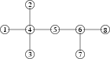

## 문제

The first stage of train system reform (that has been described in the problem Railways of the third stage of 14th Polish OI. However, one needs not be familiar with that problem in order to solve this task.) has come to an end in Byteotia. The system consists of bidirectional segments of tracks that connect railway stations. No two stations are (directly) connected by more than one segment of tracks.

Furthermore, it is known that every railway station is reachable from every other station by a unique route. This route may consist of several segments of tracks, but it never leads through one station more than once.

The second stage of the reform aims at developing train connections. Byteasar count on your aid in this task. To make things easier, Byteasar has decided that:

* one of the stations is to became a giant hub and receive the glorious name of Bitwise,
* for every other station a connection to Bitwise and back is to be set up,
* each train will travel between Bitwise and its other destination back and forth along the only possible route, stopping at each intermediate station.

It remains yet to decide which station should become Bitwise. It has been decided that the average cost of travel between two different stations should be minimal. In Byteotia there are only one-way-one-use tickets at the modest price of 1 bythaler, authorising the owner to travel along exactly one segment of tracks, no matter how long it is. Thus the cost of travel between any two stations is simply the minimum number of tracks segments one has to ride along to get from one stations to the other.

Write a programme that:

* reads the description of the train system of Byteotia,
* determines the station that should become Bitwise,
* writes out the result to the standard output.

## 입력

The first line of the standard input contains one integer n (2 ≤ n ≤ 1,000,000) denoting the number of the railway stations. The stations are numbered from 1 to n. Stations are connected by n-1 segments of tracks. These are described in the following n-1 lines, one per line. Each of these lines contains two positive integers a and b (1 ≤ a < b ≤ n), separated by a single space and denoting the numbers of stations connected by this exact segment of tracks.

## 출력

In the first and only line of the standard output your programme should print out one integer - the optimum location of the Bitwise hub. If more than one optimum location exists, it may pick one of them arbitrarily.

## 힌트

The circles in the figure depict stations (the numbers inside are the numbers of stations), while edges represent segments of tracks. Optimum locations of the Bitwise hub are the stations no. 7 or 8. If one of them is chosen, the average cost of travel between a pair of different stations equals \( \frac {36}{28} ≈ 1.2857 \) (in the example there are 28 unordered pairs of stations).
